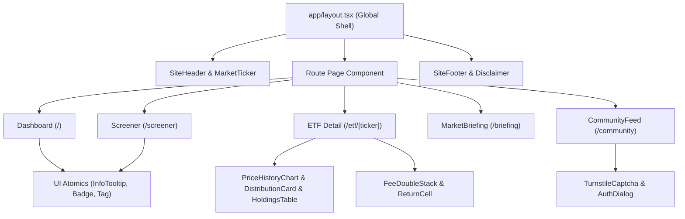
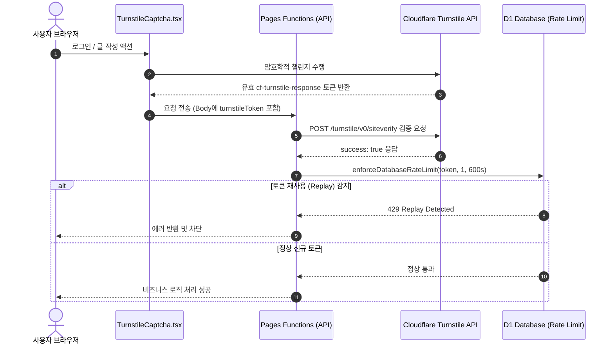
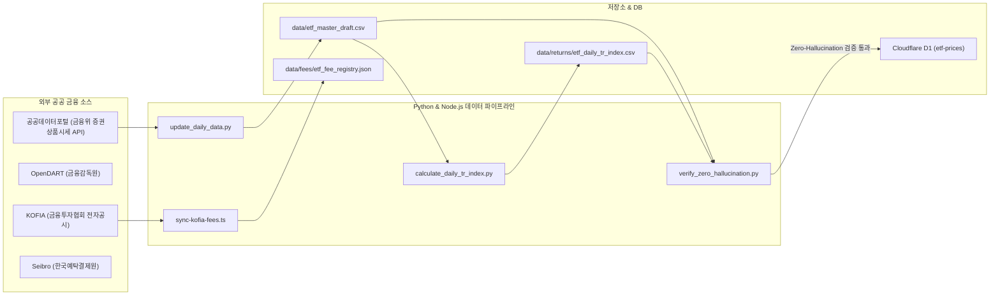

# ETF Campus 시스템 아키텍처 명세서 (`architecture_etf.md`)

> **문서 버전**: 1.0.0  
> **최종 갱신일**: 2026-09-08  
> **대상 시스템**: ETF Campus Web Platform (Next.js 14 App Router + Cloudflare Pages & Workers)  
> **문서 목적**: CODEX (GPT-6 Astra) 인계 및 고도화를 위한 전사 아키텍처 공식 명세서

---

## 1. 개요 및 설계 철학

ETF Campus는 대한민국에 상장된 **1,167개 ETF 전체의 실부담비용, 총수익률(Total Return), 분배금 이력, 포트폴리오 구성종목, 연금(DC/IRP) 및 ISA 적격성**을 제공하는 금융 특화 웹 플랫폼입니다.

### 핵심 아키텍처 원칙
1. **ZERO-HALLUCINATION POLICY (엄격한 금융 무결성)**:
   - 금융 데이터의 결측에 대해 임의 추정, 선형 보간, 더미 데이터 주입을 절대 금지하며 **Graceful Fallback**(`데이터 없음`, `미확인`)을 일관되게 반환.
   - 자본시장법 제101조를 준수하여 개별 종목 추천이나 목표가, 확정 수익률 제시를 엄격히 차단.
2. **Edge-First Static Hybrid Architecture**:
   - 1,167개 ETF의 메타데이터와 기본 속성은 빌드 타임 사전 생성(SSG)으로 Cloudflare Edge CDN에 글로벌 캐싱(TTFB < 50ms).
   - 시세 시계열, 일일 포트폴리오, 커뮤니티, 마켓 브리핑은 Cloudflare Pages Functions(엣지 런타임)와 D1/R2를 통해 동적으로 처리.
3. **Mobile-First & High-Density Financial UI**:
   - 모바일 뷰포트(360~430px)를 제1순위로 설계하여 터치 타겟(44px)과 고밀도 정보 설계(Tabular Numbers, Sticky Headers/Columns)를 전면 적용.

---

## 2. Next.js 14 라우팅 구조 (App Router)

### 2.1 라우트 디렉토리 맵

| 라우트 경로 | 소스 파일 위치 | 렌더링 모드 | 주요 역할 및 제공 데이터 |
| :--- | :--- | :---: | :--- |
| `/` | `app/page.tsx` | SSG + Client | 메인 대시보드 (일반/커버드콜/연금 탭, 자산규모 1천억 필터, 전 구간 수익률 토글) |
| `/etf/[ticker]` | `app/etf/[ticker]/page.tsx` | SSG (`generateStaticParams`) | 1,167개 ETF 개별 상세 페이지 (시세 차트, 4단 수수료 스택, 분배금 히스토리, 구성종목) |
| `/screener` | `app/screener/page.tsx` | SSG + Client | 다차원 ETF 스크리너 (운용사 다중선택, 연금저축/IRP/ISA 적격성 뱃지, 실부담비용 랭킹) |
| `/compare` | `app/compare/page.tsx` | SSG + Client | 동종 피어그룹 1:1 및 다자간 비교 툴 (수익률 오버레이 차트, 보수 격차 시뮬레이션) |
| `/briefing` | `app/briefing/page.tsx` | Client Fetch | 실시간 마켓 브리핑 대시보드 (시장 지표, ETF 요약 헤드라인, 자금유출입 TOP 랭킹) |
| `/briefing/[date]` | `app/briefing/[date]/page.tsx` | Client Fetch | 과거 특정 거래일의 아카이브 브리핑 뷰어 |
| `/style/[animal]` | `app/style/[animal]/page.tsx` | SSG (`generateStaticParams`) | 8대 투자 페르소나 동물 결과 페이지 (맞춤형 ETF 및 도서 큐레이션) |
| `/books` | `app/books/page.tsx` | SSG | AI 큐레이션 금융 도서 목록 및 제휴 링크 인덱스 |
| `/books/[slug]` | `app/books/[slug]/page.tsx` | SSG (`generateStaticParams`) | 개별 금융 도서 상세 정보 및 투자 성향별 맞춤 추천 뷰 |
| `/community` | `app/community/page.tsx` | Client + Edge API | 사용자 커뮤니티 피드 (종목 토론, Q&A, 카테고리별 필터링) |
| `/community/[slug]`| `app/community/[slug]/page.tsx`| Client + Edge API | 개별 커뮤니티 게시글 및 실시간 댓글 스레드 |
| `/admin/community-challenges` | `app/admin/community-challenges/page.tsx` | Client Admin | 커뮤니티 챌린지 및 모더레이션 대시보드 |
| `/guides`, `/notice`, `/tutorial` | `app/{guides,notice,tutorial}/page.tsx` | SSG | 투자 가이드라인, 서비스 공지사항, 창립자 서신 및 캠퍼스 투어 |

### 2.2 사전 렌더링 최적화 (`generateStaticParams`)
* `app/etf/[ticker]/page.tsx`:
  - `data/etf_master_draft.csv` 내 1,167개 티커 전체를 빌드 타임에 추출하여 정적 HTML/JSON 파라미터로 사전 빌드.
  - 빌드 타임 생성 파라미터 미포함 티커 유입 시 `dynamicParams = false` 정책으로 404 리턴.
* `app/style/[animal]/page.tsx`:
  - 8종 투자 동물(`owl`, `fox`, `bear`, `dolphin`, `elephant`, `tiger`, `eagle`, `turtle`) 정적 사전 생성.

### 2.3 SEO 및 글로벌 규격
* `app/sitemap.ts`: 1,167개 ETF 상세 URL, 브리핑, 도서 페이지를 포함하는 동적 XML 사이트맵 생성.
* `app/robots.ts`: 프로덕션/베타 환경 플래그(`config/site.ts`)에 따른 크롤러 제어.

---

## 3. 컴포넌트 계층 및 디자인 시스템

### 3.1 4계층 컴포넌트 구조
1. **Foundation & UI Atomics (`components/ui/`, `components/brand/`, `components/etf/`)**:
   - `info-tooltip.tsx`: 금융 용어(TER, 합성, 추적오차율 등) 팝업 툴팁.
   - `return-cell.tsx`: 한국 금융 시장 표준 색상(상승 빨강 `text-red-600`, 하락 파랑 `text-blue-600`) 및 `tabular-nums` 적용 셀.
   - `pension-badge.tsx`: 연금저축/IRP 투자 적격성(안전자산 100%, 위험자산 70% 한도) 뱃지.
   - `fee-stacked-bar.tsx` & `fee-double-stack.tsx`: 총보수 + 기타비용 + 매매중개수수료를 시각화한 누적 막대 차트.
   - `tickery.tsx`: 브랜드 캐릭터 '티커리' 표정/상태별 최적화 렌더러.
2. **도메인 피처 모듈 (`components/{dashboard,screener,compare,etf-detail,market-briefing}/`)**:
   - `dashboard.tsx`: 일반계좌/커버드콜/연금계좌 3대 모드 전환 대시보드.
   - `screener.tsx`: 다중 운용사 필터(`issuer-multi-select.tsx`)와 정렬 엔진 연동.
   - `etf-detail.tsx`: 시세 이력, 분배금 지급 현황, PDF 리포트 연동.
   - `market-briefing.tsx`: 시장 지수, 다차원 ETF 펄스, 자금유출입 랭킹 연동.
3. **사용자 인터랙션 및 커뮤니티 (`components/{community,onboarding,notice}/`)**:
   - `turnstile-captcha.tsx`: Cloudflare Turnstile 봇 방어 캡차 컴포넌트.
   - `community-feed.tsx`, `community-composer.tsx`: 토론 피드 및 에디터.
   - `style-onboarding.tsx`: 10문항 투자 스타일 진단 슬라이더.
4. **글로벌 셸 (`components/{site-header,site-footer,market-ticker,utm-tracker}.tsx`)**:
   - `site-header.tsx`: 네비게이션 및 모바일 햄버거 메뉴.
   - `market-ticker.tsx`: KOSPI, KOSDAQ, 환율 등 주요 지표 상단 롤링 배너.
   - `app-back-button-handler.tsx`: PWA/웹뷰 환경 뒤로가기 제어.

---

## 4. 데이터 패칭 & 렌더링 파이프라인

### 4.1 정적 생성 (SSG) 주입 파이프라인
* 빌드 시점에 아래 CSV/JSON 데이터셋을 직접 파싱하여 정적 번들에 컴파일:
  - `data/etf_master_draft.csv`: 1,167개 ETF 마스터 레코드 (티커, 국문명, 운용사, 상장일, 기초지수, 순자산총액).
  - `data/etf_returns_draft.csv`: 기간별 총수익률 (1D, 1W, 1M, 3M, 6M, 1Y, 3Y, 설정이후).
  - `data/comparison/etf_comparison_classification.csv`: 비교 분류 체계 (피어그룹 및 세부 테마).
  - `data/fees/etf_fee_registry.json`: KOFIA 공시 기반 월간 실부담비용 (총보수, TER, 실질비용).

### 4.2 Cloudflare Pages Functions (Edge API Routes)

| API 엔드포인트 | 핸들러 소스 파일 | 데이터 저장소 | 캐싱 정책 | 응답 포맷 및 역할 |
| :--- | :--- | :---: | :---: | :--- |
| `GET /api/prices/history?ticker=XXX&period=YYY` | `functions/api/prices/history.js` | Cloudflare D1 (`etf_prices`) | Edge Cache (1시간) | 시세 시계열 데이터 (`{ dates: [], closes: [], navs: [] }`) |
| `GET /api/briefings/latest` | `functions/api/briefings/latest.js` | Cloudflare D1 / R2 | Memory + Edge Cache (5분) | 최신 마켓 브리핑 JSON |
| `GET /api/briefings/:date` | `functions/api/briefings/[date].js` | Cloudflare D1 / R2 | Edge Cache (24시간) | 특정 거래일의 마켓 브리핑 JSON |
| `GET /api/holdings/:ticker` | `functions/api/holdings/[ticker].js` | Cloudflare D1 (`etf_holdings`) | Edge Cache (12시간) | ETF 포트폴리오 상위 구성종목 리스트 |
| `POST /api/community/auth/request-otp` | `functions/api/community/auth/request-otp.ts` | Supabase Auth / Resend | No Cache | Turnstile 검증 후 6자리 이메일 OTP 발송 |
| `POST /api/community/auth/verify-otp` | `functions/api/community/auth/verify-otp.ts` | Supabase Auth | No Cache | OTP 검증 및 JWT 세션 쿠키 발급 |
| `GET /api/community/posts` | `functions/api/community/posts/index.ts` | Supabase / D1 | Stale-While-Revalidate (60s) | 커뮤니티 게시글 피드 목록 조회 |

---

## 5. Cloudflare Turnstile 봇 방어 및 인증 보안 아키텍처

### 5.1 보안 세부 사양
* **클라이언트 통합 (`components/community/turnstile-captcha.tsx`)**:
  - `https://challenges.cloudflare.com/turnstile/v0/api.js?render=explicit` 스크립트를 동적으로 로드.
  - 다이얼로그 언마운트 시 `turnstile.remove()`를 호출하여 메모리 누수 방지.
* **서버 검증 (`functions/api/community/_lib/request-security.js`)**:
  - `https://challenges.cloudflare.com/turnstile/v0/siteverify` 엔드포인트로 `secret`과 `response` 토큰 전송.
  - `turnstileConfigurationError`: 환경 변수 미설정 시 프로덕션에서 즉각적인 500 에러를 반환하여 우회 방지.
* **토큰 리플레이 방어 (Anti-Replay Rate Limit)**:
  - 검증 성공한 Turnstile 토큰의 고유 해시값을 D1 데이터베이스에 600초(10분) TTL로 기록.
  - 동일 토큰이 재전송될 경우 429 Too Many Requests 에러와 함께 차단.

---

## 6. 외부 공공 금융 데이터 API 연동 체계

### 6.1 공공데이터포털 (data.go.kr) - 금융위원회 증권상품시세정보 API
* **연동 엔드포인트**: `https://apis.data.go.kr/1160100/service/GetSecuritiesProductInfoService/getETFPriceInfo`
* **수집 주기 및 스크립트**: 매 영업일 16:30 KST (`scripts/update_daily_data.py`, `scripts/append_daily_prices.py`).
* **수집 필드**: 기준일자(`basDt`), 단축코드(`srtnCd`), 종목명(`itmsNm`), 종가(`clpr`), 순자산가치(`nav`), 상장주식수, 거래대금.
* **예외 처리**: 공공데이터포털 서버 지연 대응 지수 백오프(Exponential Backoff, 최대 3회 재시도).

### 6.2 OpenDART API (금융감독원)
* **연동 현황**: 운용사 고유번호(`corpCode.xml`) 및 공시 목록 조회(`list.json`).
* **기술적 제약사항 (Critical Restriction)**:
  - `document.xml` API 호출 시 투자설명서/신탁약관의 **본문이 절단(Truncation)**되어 표지만 반환되는 구조적 한계 확인.
  - 이에 따라 약관상 파생상품 위험평가액(100% 초과 여부)은 API로 수집하지 않으며, 운용사 공식 공시 원문 직접 증빙(`data/fees/official_total_fee_promoted_v1.json`) 전까지 자의적 보간을 금지함.

### 6.3 KOFIA (금융투자협회 전자공시)
* **수집 대상**: 월간 펀드 보수 및 비용 비교공시 (총보수비용비율 TER, 매매·중개수수료율).
* **스크립트**: `scripts/sync-kofia-fees.ts` (Playwright 기반 자동화 스크레이퍼).
* **통계적 서킷 브레이커**: 이상치 발생률이 전체의 5%를 초과할 경우 레지스트리 병합을 즉시 중단하고 경보 발송.

### 6.4 Gemini AI 7-Token Pool & 5-Tier Waterfall 클라이언트
* **소스**: `lib/ai/gemini-client.ts` (`callGeminiWithWaterfall`).
* **7대 토큰 풀 로드밸런싱**: `MASTER_GEMINI_TOKENS`를 순회하며 429/403 발생 시 자동 전환.
* **5계층 모델 워터폴**:  
  `gemini-3.8-flash` ➡️ `gemini-3.7-flash` ➡️ `gemini-3.6-flash` ➡️ `gemini-flash-latest` ➡️ `gemini-2.5-flash`
* **비상 방어 (Graceful Fallback)**: 모든 토큰 고갈 시 사전에 검증된 정적 금융 위원회 분석 데이터로 무중단 폴백.

---

## 7. 인프라 및 CI/CD 아키텍처

1. **GitHub Actions**:
   - `Fast Validation` (`ci-fast.yml`): Push마다 Lint, Typecheck, 444개 Vitest, 3개 Worker Typecheck 수행 (< 3분).
   - `Daily ETF market data refresh` (`daily-market.yml`): 장 마감 후 공공데이터 수집 및 마스터 데이터 갱신.
   - `Daily Holdings Composition Audit` (`holdings-audit.yml`): D1 보유종목 가중치 합계 100% 무결성 감사.
2. **Cloudflare 배포 스택**:
   - **Cloudflare Pages**: Next.js 빌드 산출물 글로벌 엣지 서빙 (`etf-campus.pages.dev`).
   - **Cloudflare D1**: SQLite 기반 시세/보유종목/인증 데이터베이스.
   - **Cloudflare R2**: 마켓 브리핑 일일 스냅샷 및 정적 이미지 보관.
   - **Cloudflare Workers**:
     - `market-briefing-publisher`: 브리핑 집계 및 스냅샷 발행.
     - `market-briefing-distributor`: 알림/배포 워커.
     - `community-maintenance`: 커뮤니티 정기 정제 워커.
