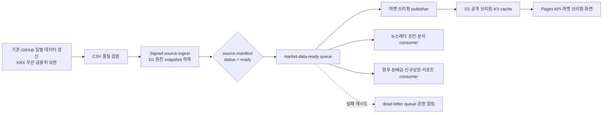

# ETF Campus 마켓 브리핑 — 확장형 자동화 아키텍처 제안

## 1. 결론과 설계 원칙

ETF Campus에는 이미 매 거래일 아침에 공식 ETF 데이터를 갱신하는 자동화가 있습니다. 이 작업은 KRX Open API를 우선 호출하고, 필요 시 금융위원회 공공데이터포털 ETF API로 보완하여 `etf_master_draft.csv`를 갱신하며, 종가는 D1 `etf_prices`에도 적재합니다. 마켓 브리핑은 이 원천 수집을 다시 실행해서는 안 됩니다.

> **원칙: 수집은 한 번만 하고, 이후 모든 기능은 기준일이 확정된 D1 snapshot을 읽는다.**

이 원칙을 지키면 API 호출 중복, 기준일 불일치, 기능 추가에 따른 작업 간 간섭을 막을 수 있습니다. 뉴스레터 원고 보조, 분배금 분석, 신규 상장 감시, 성과 리포트처럼 후속 기능이 늘어나도 동일 snapshot을 각자 읽어 독립적으로 실행할 수 있습니다.

## 2. 현재 구조에서 보완할 지점

현재 일별 갱신은 가격·등락률·거래대금·순자산·위험유형·자산군을 포함한 master CSV를 생성합니다. 반면 D1 `etf_prices`에는 `ticker`, `date`, `close`만 있습니다. 이것만으로는 AUM 가중수익률, 자산군별 기여도, 거래대금 상위 ETF를 재현할 수 없습니다.

따라서 필요한 추가 작업은 새 API 수집기가 아니라, **기존 갱신 결과의 확정된 전체 row를 D1 원천 snapshot으로 적재하는 단계**입니다. KOSPI·KOSDAQ도 같은 기존 KRX key를 사용해 이 단계에서 한 번만 수집·검증합니다.

| 데이터 계층 | 책임 | 쓰기 주체 | 읽기 주체 |
| --- | --- | --- | --- |
| 원천 수집 | KRX 우선·금융위원회 보완, CSV 갱신, 기준일 품질 검사 | 기존 GitHub 일별 workflow | 없음 |
| 원천 snapshot | ETF 전체 정량 row·KOSPI·KOSDAQ·검증 결과를 기준일 단위로 확정 | signed source-ingest endpoint | 브리핑·뉴스레터·분배금·리포트 등 모든 후속 기능 |
| 파생 산출물 | 브리핑 카드·자산군·기여도·공개 payload | 마켓 브리핑 publisher | Pages API·프런트엔드 |
| 공개 cache | 최신 브리핑 조회 성능 | publisher | Pages API |

## 3. 장기 자동화 방식 비교

| 방식 | 동작 | 프로세스 간 간섭 | 확장성 | 설정·운영 복잡도 |
| --- | --- | --- | --- | --- |
| A. 이벤트 기반 snapshot 파이프라인 | 확정 snapshot이 준비되면 event를 발행하고, 각 후속 consumer가 독립 실행 | 가장 낮음. 수집 실패가 브리핑·뉴스레터 작업을 직접 중단시키지 않음 | 높음. 새 기능은 새 consumer만 추가 | 중간 |
| B. D1 readiness polling | 각 Worker가 정해진 시간에 `market_source_snapshot_manifest`의 ready 상태를 조회 | 낮음. 다만 새 기능마다 polling schedule이 늘어남 | 중간 | 낮음 |
| C. 단일 일별 workflow 직렬 처리 | 수집 뒤 같은 workflow에서 브리핑·뉴스레터·분석을 차례대로 실행 | 높음. 하나의 실패가 뒤 단계를 막음 | 낮음 | 가장 낮음 |

방식 A는 원천 적재 성공 후에만 후속 작업을 알리고, 중간 consumer 실패는 원천 snapshot을 다시 가져오지 않고 재시도할 수 있습니다. Cloudflare Queue는 Worker 간 메시지를 전달하고, 재시도·지연·dead-letter queue를 지원합니다.[1] [2] 이 구조는 기능 수가 늘어날수록 작업 간 결합도를 줄이는 효과가 큽니다.

방식 B는 Queue를 도입하지 않고 현재의 06:13/06:17 시간표를 유지하는 가벼운 대안입니다. 현재처럼 기능이 마켓 브리핑 하나뿐이라면 충분히 안정적입니다. 다만 향후 여러 후속 프로세스가 같은 snapshot을 기다리면 각 프로세스마다 retry cron과 상태 조회가 늘어나므로 관리 지점이 증가합니다.

## 4. 권장 대상 구조: 원천 snapshot event hub

향후 프로세스 증가와 독립 운영을 우선한다면 아래 구조가 적합합니다.

### 4.1 원천 수집 단계의 책임

기존 GitHub Actions workflow는 현재처럼 KRX Open API와 공공데이터포털 key를 보유합니다. ETF 가격을 수집하고, master CSV의 품질을 검증하며, KOSPI·KOSDAQ 일별 지수도 수집합니다. 이 단계는 **외부 API를 호출할 수 있는 유일한 단계**입니다.

성공한 기준일에만 `market_source_etf_daily`, `market_source_index_daily`, `market_source_snapshot_manifest`를 D1에 적재합니다. manifest는 기준일당 하나이며, 다음 최소 정보를 가집니다.

| manifest 항목 | 의미 |
| --- | --- |
| `as_of_date` | 실제 시장 기준일 |
| `status` | `collecting`, `ready`, `suppressed`, `failed` |
| `snapshot_version` | CSV commit SHA 또는 source hash |
| `etf_row_count` | ETF snapshot row 수 |
| `general_etf_count` | 일반 ETF 수 |
| `kospi_as_of_date`, `kosdaq_as_of_date` | 지수 기준일 |
| `validation_json` | AUM coverage·row count·날짜 일치 검증 결과 |
| `ready_at` | 후속 소비 가능 시각 |

ETF·KOSPI·KOSDAQ 기준일이 일치하고 품질 검증을 통과했을 때만 `ready`로 바뀝니다. `ready` 변경과 event 발행은 하나의 idempotency key(`as_of_date:snapshot_version`)로 결합합니다.

### 4.2 마켓 브리핑 단계의 책임

마켓 브리핑 publisher는 API key와 원천 endpoint를 전혀 갖지 않습니다. Queue event가 가리키는 D1 manifest를 다시 읽고, 상태가 `ready`이며 같은 기준일 브리핑이 아직 없을 때만 산출합니다.

이 단계는 기존의 `market_data_readiness`, `briefing_publication_runs`, `briefing_publication_locks`, `market_briefings`를 사용합니다. 동일 event가 중복 전달되어도 `as_of_date` unique key와 publication lock으로 결과가 한 번만 만들어집니다. 이후에는 KV 공개 payload를 갱신하고 Pages API가 이를 조회합니다.

### 4.3 후속 기능을 추가하는 방식

뉴스레터 초안, 자산군 심화 분석, 분배금 변화 감시, 새로운 리포트는 원천 수집이나 마켓 브리핑 코드를 수정하지 않습니다. 각 기능은 `market-data-ready` event를 받는 별도 consumer로 추가하고, D1 snapshot만 읽습니다.

이 구조에서는 한 consumer의 실패가 다른 consumer의 실행을 막지 않습니다. 예를 들어 뉴스레터 초안 생성이 실패해도 마켓 브리핑은 계속 공개되고, 분석 worker는 동일 snapshot 기준으로 나중에 별도 재처리할 수 있습니다.

## 5. 장애 격리·재시도·재처리 규칙

| 상황 | 원천 snapshot | 마켓 브리핑 | 운영 처리 |
| --- | --- | --- | --- |
| API 지연·휴장 | `delayed` 또는 이전 ready 유지 | 새 브리핑 미발행 | 기존 workflow의 06:17·07:17·08:17·09:17 재시도 |
| ETF 품질 실패 | `suppressed` | 미발행 | P1 알림과 검증 세부 내용 저장 |
| 지수 기준일 불일치 | `delayed` | 미발행 | 다음 source retry를 기다림 |
| publisher 일시 장애 | snapshot은 `ready` 유지 | Queue 재시도 | 메시지 재시도 뒤 DLQ 이동 |
| 뉴스레터 consumer 장애 | snapshot은 `ready` 유지 | 브리핑은 정상 | 뉴스레터만 독립 재처리 |
| 데이터 정정 | 새 `snapshot_version` 기록 | 명시적 재발행 정책에 따라 처리 | 기준일·버전을 지정해 replay event 발행 |

Queue consumer는 처리 완료된 메시지를 명시적으로 확인하고, 실패 메시지만 재시도하도록 구성합니다. 기본 재시도 횟수는 3회이며, 최대 횟수에 도달한 메시지는 dead-letter queue로 보낼 수 있습니다.[2] DLQ는 실패 메시지를 운영자가 검토·재처리하는 통로로 사용합니다.[3]

## 6. 단계별 실제 적용 순서

### 1단계 — 기존 수집 재사용으로 전환

기존 daily workflow에 `source snapshot ingest` 단계를 추가합니다. 이 단계는 갱신된 `etf_master_draft.csv`와 KRX KOSPI·KOSDAQ 결과를 signed endpoint로 보냅니다. 현 collector의 직접 공공 API·KRX API 호출과 secret dependency는 제거합니다.

### 2단계 — D1 readiness polling으로 먼저 검증

초기에는 publisher가 06:17·07:17·08:17·09:17에 ready manifest만 조회하도록 운용합니다. 이 단계만으로도 중복 API 호출과 수집·발행 결합은 완전히 제거됩니다. 기존 06:13/06:17 구상보다 실제 daily workflow 시간표에 맞춰야 하므로, publisher slot은 source snapshot 적재 완료 여부를 검사합니다.

### 3단계 — event queue 도입

snapshot manifest가 `ready`가 될 때 `market-data-ready` event를 한 번 발행합니다. publisher를 queue consumer로 전환하고, 이후 새 기능도 각자 consumer로 추가합니다. D1 polling은 event 유실이나 긴급 재처리를 위한 보조 안전망으로만 유지합니다.

### 4단계 — 운영 안정화

DLQ, P1 alert, 기준일별 processing dashboard, manual replay action을 추가합니다. GitHub Actions와 Cloudflare 배포는 현재 CI/CD workflow를 통해 독립 배포하며, 프로덕션 배포 token은 최소 권한 범위로 유지합니다.[4]

## 7. 선택이 필요한 사항

장기 확장과 독립성을 우선하면 **방식 A**가 요구사항을 가장 많이 충족합니다. 다만 처음부터 Queue를 추가하지 않고 **방식 B**로 source snapshot·D1 readiness 경계를 먼저 완성한 다음, 기능이 두 개 이상으로 늘어나는 시점에 A로 확장하는 경로도 가능합니다.

| 확인할 선택 | 선택 시 다음 구현 |
| --- | --- |
| A. event hub까지 한 번에 구축 | source snapshot ingest, Queue, DLQ, publisher consumer를 함께 구현 |
| B. D1 readiness 기반으로 먼저 안정화 | source snapshot ingest와 D1-only publisher를 먼저 구현하고 Queue는 다음 단계에 추가 |

## References

[1]: https://developers.cloudflare.com/queues/ "Cloudflare Queues Overview"
[2]: https://developers.cloudflare.com/queues/configuration/batching-retries/ "Cloudflare Queues — Batching, retries and delays"
[3]: https://developers.cloudflare.com/queues/configuration/dead-letter-queues/ "Cloudflare Queues — Dead Letter Queues"
[4]: https://developers.cloudflare.com/workers/ci-cd/external-cicd/github-actions/ "Cloudflare Workers — GitHub Actions CI/CD"
