# ETF 캠퍼스 기능·메뉴 카탈로그

작성일: 2026-09-16
작성: EVS Navigator
기준 화면: `https://etf-campus.pages.dev` · 데이터 기준일 2026-09-15 장마감
용도: 지원서·IR·제휴 제안·온보딩 문서에서 꺼내 쓰는 공용 참조본

---

## 0. 한 줄 정의

**국내 상장 ETF 전 종목에 대해 "얼마를 내는가"와 "내 계좌에서 살 수 있는가"를 공시 기준으로 계산해 주는 서비스입니다.**

종목을 추천하지 않습니다. 계산과 판정만 제공하고 판단은 이용자가 합니다.

---

## 1. 메뉴 구조

```
ETF 캠퍼스
├── 마켓 브리핑      매 거래일 자동 생성 시장 리포트 (7단계)
├── 캠퍼스 투어      설립 취지문 · 시설 안내 · 팩트체크 퀴즈
├── ETF 탐색         계좌별·전략별 스크리너
│   ├── 계좌별        전체계좌 · 퇴직연금 · 연금저축 · 중개형 ISA
│   └── 전략별        혼합채권 · TDF · 커버드콜 · 레버리지·인버스 · 신규 상장
├── ETF 비교         최대 5종목 직접 비교 · 동종 자동 매칭
├── ETF 이야기       질문·토론 게시판 (3개 분류)
├── 도서·리뷰        3대 서점 평점 교차 검증
└── 알림·참여        [미확인 — 화면 미수집]

부가
├── 종목 상세 페이지   수익률·비용·구성종목·분배금
├── 투자 성향 진단     10문항 · 동물 캐릭터 결과
└── A4 치트시트 PDF   팩트체크 5단계 완주 시 발급
```

---

## 2. 핵심 수치 한눈에

```
전체 분석 종목            1,171종목
브리핑 분석 대상           1,023개 (일반 ETF, 레버리지·인버스 제외)

계좌별 적격 종목
  일반 위탁              1,171   매매차익 비과세 353 · 과세 818
  퇴직연금 DC·IRP        1,034   안전자산 100% 222 · 위험자산 70% 812 · 법정 배제 137
  연금저축               1,068   개인연금 전용 34 · 법정 제외 103
  중개형 ISA              818   절세 실익 종목만 (전체 편입 가능 1,167)

전략별 분류
  혼합채권                 44종목
  TDF · 커버드콜 · 레버리지·인버스 · 신규 상장   [종목 수 미확인]
```

---

## 3. 마켓 브리핑

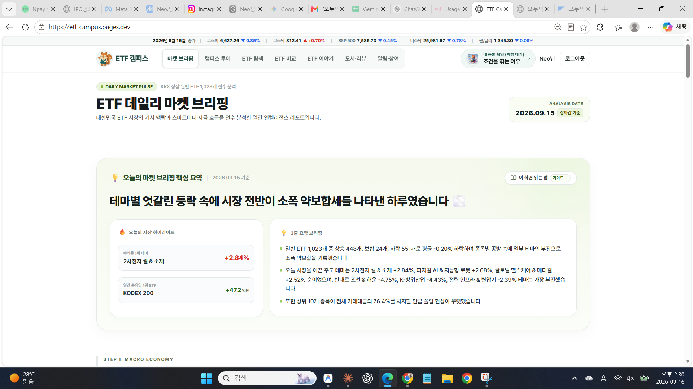

**매 거래일 장 마감 후 자동 생성됩니다.** 사람이 쓰지 않습니다.

상단에 3줄 요약, 수익률 1위 테마, 일간 순유입 1위 ETF 가 배치됩니다.

**7단계 구성입니다.**

```
STEP 1   거시 지표        환율·금리·유가·VIX 등 12개 지표
STEP 2   시장 온도        1,000여 개 ETF 의 상승·보합·하락 비율, 상위 10개 거래 쏠림도
STEP 3   세부 동향        7대 자산군 기여도 매트릭스, 테마 롱숏 (상위 3 vs 하위 3)
STEP 4   자금 동향        당일 실질 순유입 상위 5
STEP 5   주·월간 트렌드    중기 펀드 플로우 비교
STEP 6   시장 구조 스냅샷   일반·파킹·레버리지·인버스 4대 유형 듀얼 게이지, 회전율
STEP 7   성장·유동성 추이   일·주·월·연 AUM 브릿지 분해
```

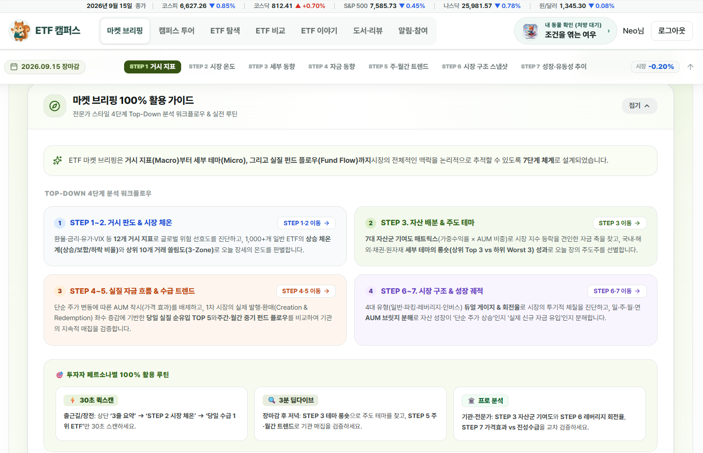

**투자자 유형별 활용 동선을 같이 제공합니다.** 30초 퀵스캔 · 3분 딥다이브 · 프로 분석 세 가지입니다.

### 3-1. 기술적으로 가장 중요한 지점 — STEP 4·5

**자금 유출입을 순자산 증감으로 계산하면 틀립니다.** 주가가 올라 순자산이 늘어난 것(가격 효과)과 실제로 돈이 들어온 것이 섞이기 때문입니다.

```
잘못된 계산   AUM(T) − AUM(T-1)
올바른 계산   ( AUM(T)/NAV(T) − AUM(T-1)/NAV(T-1) ) × NAV(T)
```

**상장좌수 공시 값이 전일 기준이라는 점을 교차 검증으로 확인한 뒤, 1차 시장의 발행·환매 좌수 증감으로 역산합니다.**

**외부 문서에서 인용할 때의 문장입니다.** "공시를 그대로 옮기는 것과 공시가 어디서 왜곡되는지 아는 것의 차이입니다." 도메인 지식 없이는 나오지 않는 구현이라는 점이 핵심입니다.

---

## 4. ETF 탐색 — 계좌별 스크리너

**이용자가 자기 계좌를 먼저 고르면, 그 계좌에서 실제로 살 수 있는 종목만 남습니다.**

### 4-1. 전체계좌 (일반 위탁)

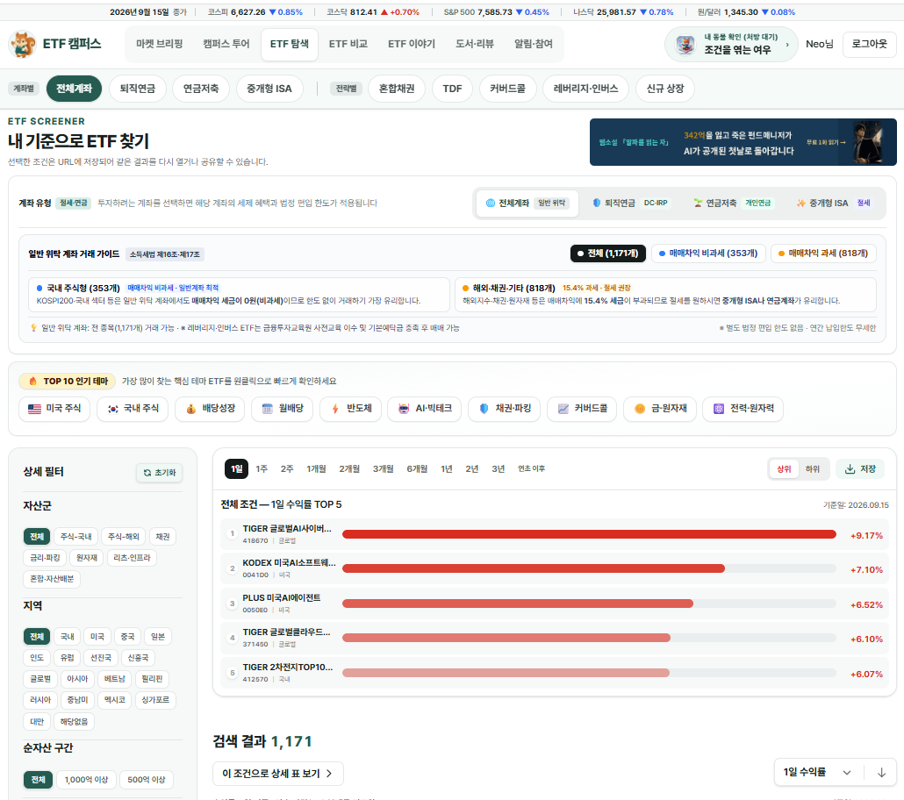

```
전체 1,171개
  매매차익 비과세 353개    KOSPI200·국내 섹터 등. 한도 없이 거래
  매매차익 과세   818개    해외지수·채권·원자재. 15.4% 과세 → ISA·연금계좌 권장
```

근거: 소득세법 제16조·제17조. 레버리지·인버스는 사전교육 이수 후 매매 가능.

### 4-2. 퇴직연금 (DC·IRP)

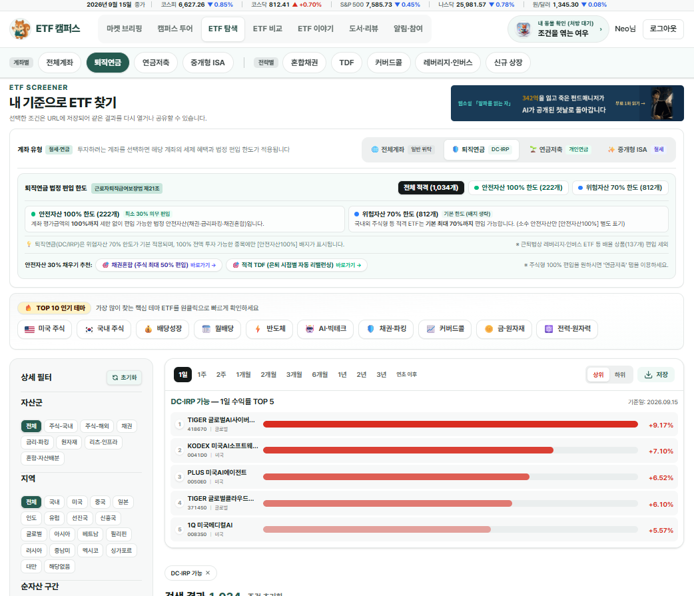

```
전체 적격 1,034개
  안전자산 100% 한도  222개   계좌 평가금액 100%까지 편입 가능. 최소 30% 의무 편입
  위험자산 70% 한도   812개   국내외 주식형 등. 최대 70%까지
  법정 배제          137개   레버리지·인버스 등
```

근거: 근로자퇴직급여 보장법 제21조, 퇴직연금감독규정 제12조 제4항(위험자산 70% 한도), 제9조 제1항 제2호(파생 위험평가액 40% 한도).

**안전자산 30% 채우기 동선을 함께 제공합니다.** 채권혼합(주식 최대 50% 편입)과 적격 TDF 로 바로 가는 링크입니다.

### 4-3. 연금저축

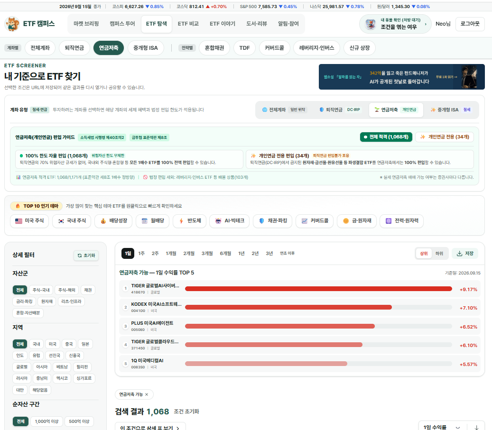

```
전체 적격 1,068개
  100% 한도 자율 편입   1,068개   위험자산 한도 규제 없음. 1배수 ETF 전액 편입 가능
  개인연금 전용          34개     퇴직연금에서 금지된 원자재·금선물·원유선물 등
  법정 제외             103개     레버리지·인버스
```

근거: 소득세법 시행령 제40조의2, 금융투자협회 표준약관 제8조.

**이 화면의 실용적 가치가 큽니다.** 퇴직연금에서 막히는 상품을 연금저축에서는 담을 수 있다는 구분을 아는 가입자가 드뭅니다.

주의: 실제 매매 가능 여부는 증권사마다 다를 수 있다는 안내가 화면에 있습니다.

### 4-4. 중개형 ISA

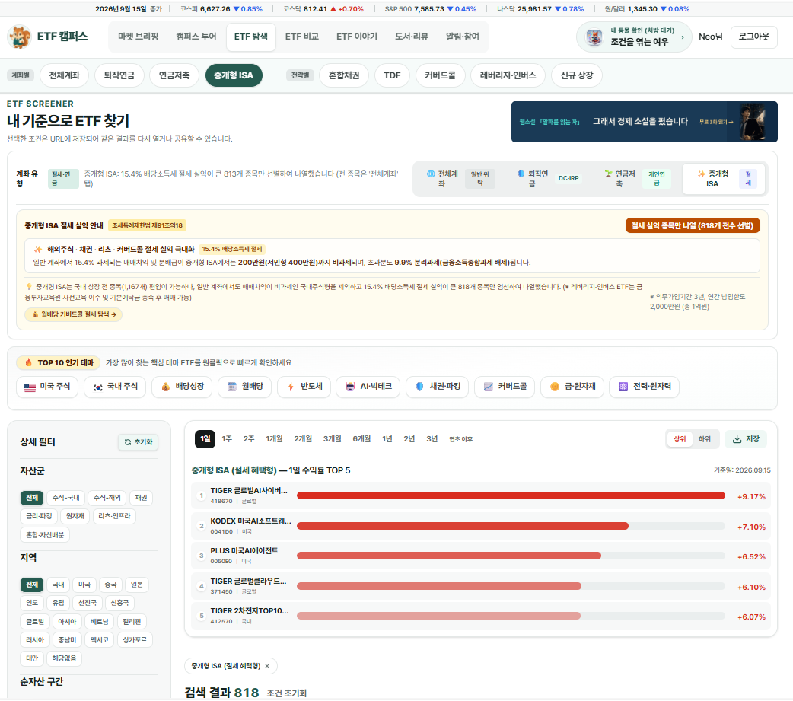

```
편입 가능       1,167개
절세 실익 종목    818개   해외주식·채권·리츠·커버드콜
제외 이유              국내주식형 353개는 일반계좌에서도 매매차익 비과세라 실익 없음
```

```
배당소득세 15.4%  →  200만 원(서민형 400만 원)까지 비과세
                     초과분 9.9% 분리과세 (금융소득종합과세 배제)
의무가입기간 3년 · 연간 납입한도 2,000만 원 · 총 1억 원
```

근거: 조세특례제한법 제91조의18.

---

## 5. ETF 탐색 — 전략별 분류

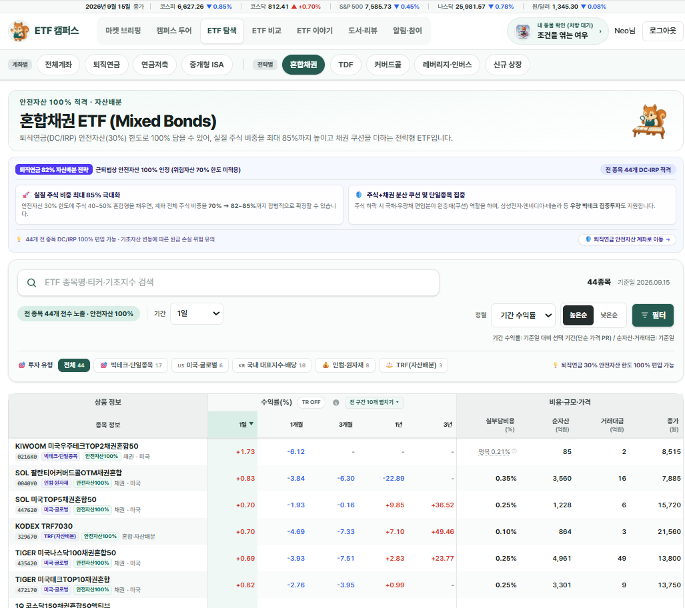

```
혼합채권          44종목   전 종목 DC·IRP 안전자산 100% 적격
TDF                       은퇴 시점별 자동 리밸런싱
커버드콜                   월배당 구조
레버리지·인버스              퇴직연금 편입 불가. 사전교육 필요
신규 상장                  최근 상장 종목
```

**⚠️ 이 화면 문구는 검토 대상입니다.** "실질 주식 비중 최대 85% 극대화", "합법적으로 확장할 수 있습니다"는 사실 관계는 맞으나 **권유의 문장 구조**입니다. 사실 서술로 바꾸는 것을 권고합니다. 상세는 §10 참조.

---

## 6. ETF 비교

### 6-1. 직접 비교 — 최대 5종목

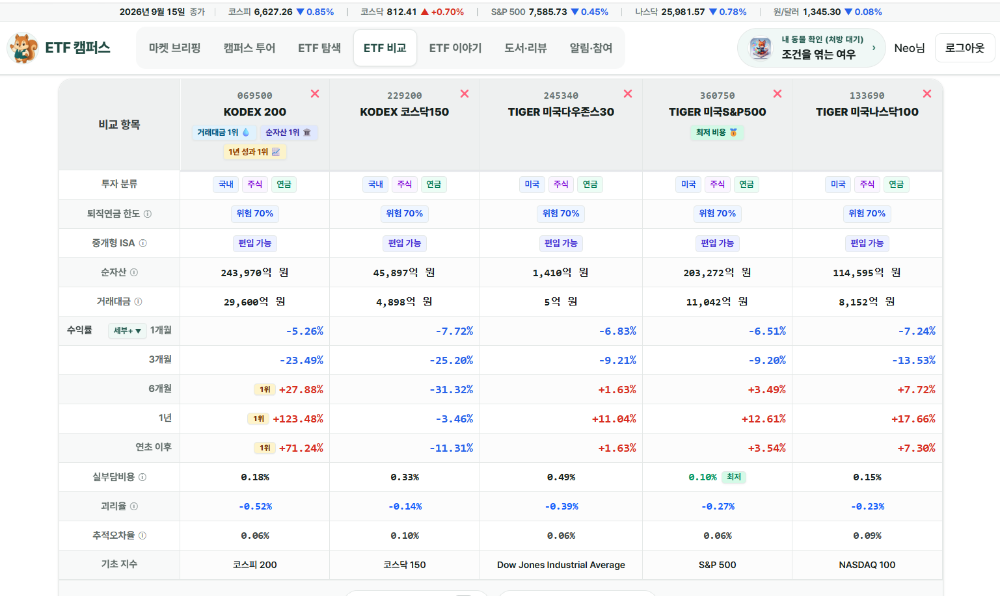

```
비교 항목
  투자 분류 · 퇴직연금 한도 · 중개형 ISA 편입 여부
  순자산 · 거래대금
  수익률 1개월 / 3개월 / 6개월 / 1년 / 연초 이후 (최대 3년, 기간 직접 입력 가능)
  실부담비용 · 괴리율 · 추적오차율 · 기초지수
```

**가장 유리한 항목에 배지가 자동으로 붙습니다.** 거래대금 1위, 순자산 1위, 1년 성과 1위, 최저 비용.

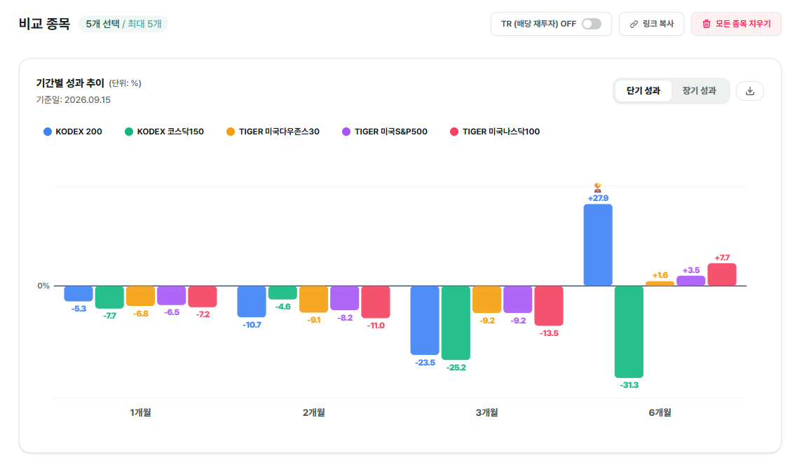

TR(배당 재투자) 토글과 단기·장기 성과 전환, 차트 다운로드를 제공합니다.

### 6-2. 동종 ETF 자동 비교

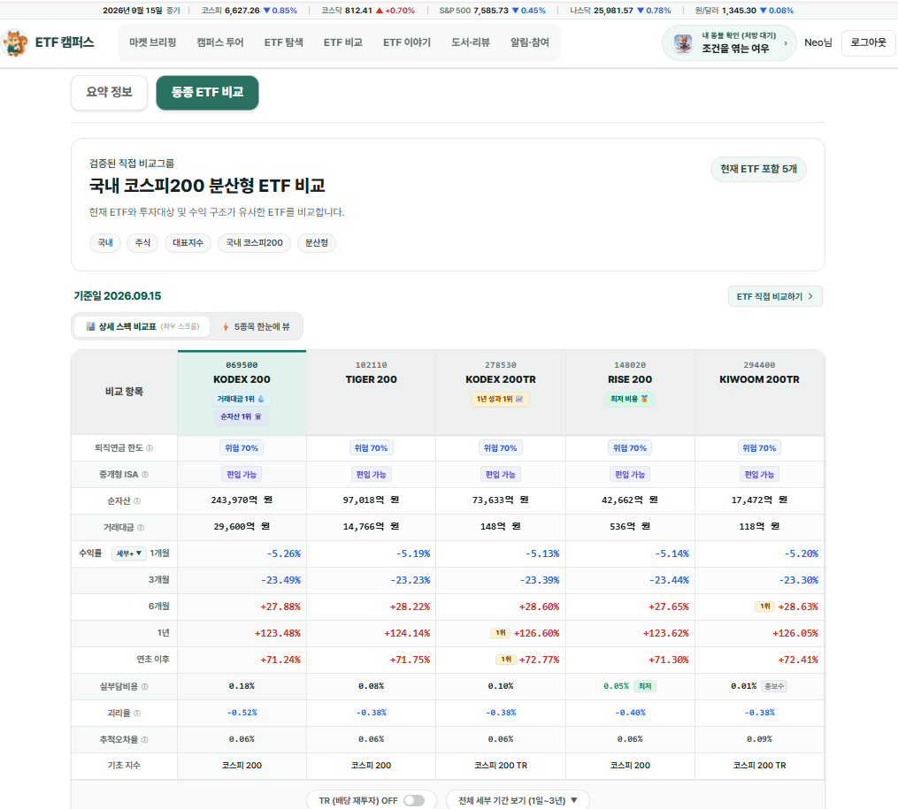

**알고리즘이 "투자 대상과 수익 구조가 유사한 ETF"를 자동으로 찾아 비교 그룹을 구성합니다.**

```
국내 코스피200 분산형 ETF 비교        실부담비용        1년 수익률
  069500  KODEX 200                 0.18%          +123.48%
  102110  TIGER 200                 0.08%          +124.14%
  278530  KODEX 200TR               0.10%          +126.60%
  148020  RISE 200                  0.05%  최저     +123.62%
  294400  KIWOOM 200TR              0.01%  총보수    +126.05%
```

**이 화면이 서비스 전체에서 가장 설득력이 높습니다.**

같은 지수를 추종하고 성과도 거의 같은데 **실부담비용만 0.05퍼센트와 0.18퍼센트로 3.6배 차이**가 납니다. 1억 원 기준 연 5만 원과 연 18만 원입니다.

**외부 문서 인용 시 이 사례를 최우선으로 쓰십시오.** 심사자나 독자가 "그럼 싼 걸 사면 되잖아"라고 생각하는 순간 서비스의 필요성이 스스로 증명됩니다.

---

## 7. 종목 상세 페이지

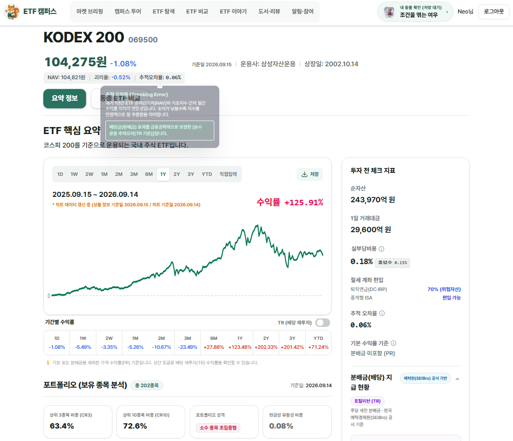

```
상단        현재가 · NAV · 괴리율 · 추적오차율 · 운용사 · 상장일
차트        1D~3Y·YTD·직접입력, 다운로드 가능
기간별 수익률  1D 1W 2W 1M 2M 3M 6M 1Y 2Y 3Y YTD, TR 토글
우측 패널     순자산 · 1일 거래대금 · 실부담비용(총보수 병기)
            절세 계좌 편입 — 퇴직연금 판정 · 중개형 ISA 판정
            추적오차 · 기본 수익률 기준(PR/TR)
            분배금 지급 현황 (예탁원 SEIBro 공시 기반)
```

**실부담비용과 총보수를 나란히 표시합니다.** 예: 실부담비용 0.18% / 총보수 0.15%.

### 7-1. 구성종목 전수 공개

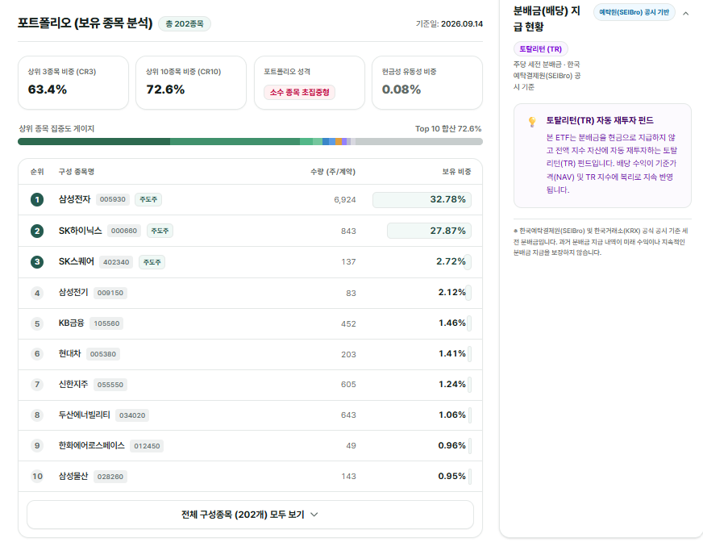

```
총 202종목 (KODEX 200 기준)
상위 3종목 비중 (CR3)    63.4%
상위 10종목 비중 (CR10)  72.6%
포트폴리오 성격          소수 종목 초집중형
현금성 유동성 비중        0.08%
```

종목별 수량(주·계약)과 보유 비중을 전량 노출하고, 주도주에는 배지가 붙습니다.

**이 데이터가 분류 오류 8건을 적발한 근거입니다.** 종목명 키워드가 아니라 실제 보유 자산으로 검증했습니다.

```
183710  RISE 주식혼합              채권 → 혼합·자산배분   KOSPI200 주식 70%
341850  TIGER 리츠부동산인프라채권    채권 → 혼합·자산배분   리츠·인프라 70%
480460  WON 한국부동산TOP3플러스    주식-국내 → 리츠·인프라  리츠 95.7%
0036Z0  RISE 미국천연가스밸류체인    원자재 → 주식-해외     주식 99.6%
473640  HANARO 글로벌금채굴기업     원자재 → 주식-해외     주식 93.3%
474800  KIWOOM 미국원유에너지기업   원자재 → 주식-해외     주식 99.3%
497780  KoAct 미국천연가스인프라     원자재 → 주식-해외     주식 97.9%
0137W0  KIWOOM 미국S&P500&GOLD   원자재 → 복합자산(보류)  주식 86.6% + 금
```

**앞의 두 건은 안전자산으로 판정되고 있었습니다.** 그대로 담으면 위험자산 70퍼센트 한도 계산이 통째로 틀어집니다.

---

## 8. 캠퍼스 투어 — 팩트체크 퀴즈

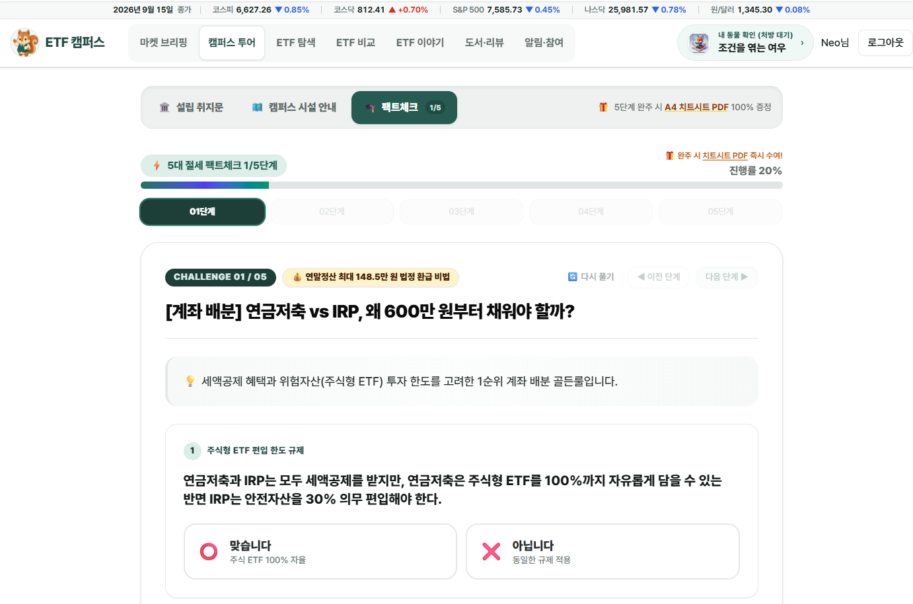

```
5단계 O/X 퀴즈
완주 시 A4 치트시트 PDF 발급 (2026 직장인 3대 절세계좌 운용 요약, 인쇄용 고해상도)
```

**리드 마그넷입니다.** 텍스트를 읽지 않는 이용자를 3분 안에 핵심 규정으로 데려가고, 발급 과정에서 재방문 동기를 만듭니다.

**⚠️ 배지 문구 "연말정산 최대 148.5만 원 법정 환급 비법"의 "비법"은 검토 대상입니다.** §10 참조.

---

## 9. 커뮤니티·부가 기능

### 9-1. ETF 이야기 (게시판)

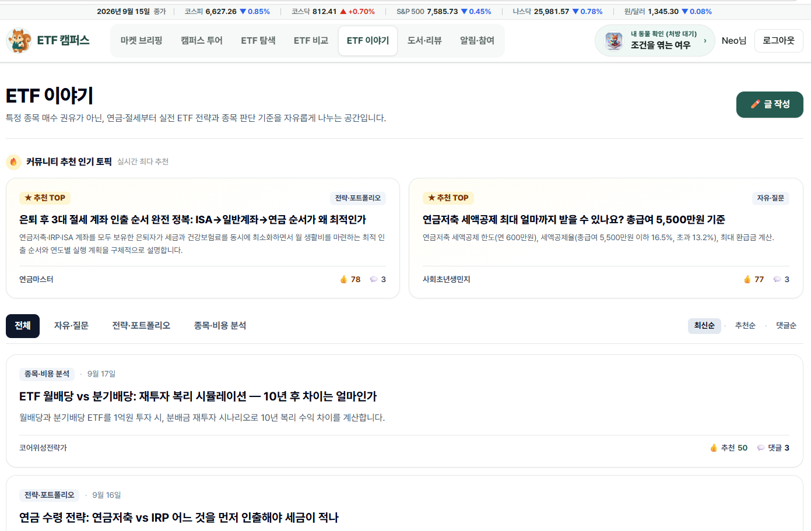

```
분류    자유·질문 / 전략·포트폴리오 / 종목·비용 분석
기능    글 작성 · 추천 · 댓글 · 정렬(최신·추천·댓글)
상단    커뮤니티 추천 인기 토픽 (실시간 최다 추천)
```

**⚠️ 현재 게시글은 시드 콘텐츠입니다.** 실제 이용자 작성분이 아닙니다.

**외부 문서에 쓸 때의 표현 기준입니다.**

```
쓰지 말 것   활성화된 커뮤니티가 있습니다 · 이용자가 질문하고 답하고 있습니다
쓸 것        질문과 답을 주고받는 게시판을 만들어 두었습니다. 아직 초기 단계입니다
```

**활성화 이후 계획**: 축적된 질문을 소재로 콘텐츠를 생성하는 구조로 연결합니다. 이용자의 실제 질문이 가장 좋은 콘텐츠 소재이기 때문입니다.

### 9-2. 투자 성향 진단

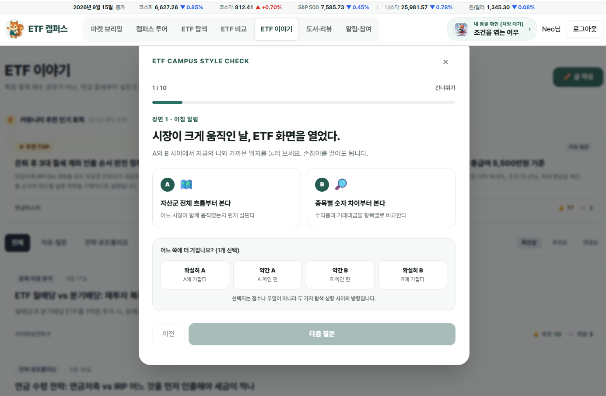

```
10문항 · A/B 양극 척도 4단계 (확실히 A / 약간 A / 약간 B / 확실히 B)
결과    동물 캐릭터 (예: 조건을 엮는 여우)
```

**설계상 중요한 점이 있습니다.** 화면에 "선택지는 점수나 우열이 아니라 두 가지 탐색 성향 사이의 방향입니다"라고 명시되어 있습니다. **적합성 평가(투자성향진단)로 오인될 소지를 사전에 차단한 설계입니다.** 대외 설명 시 이 점을 함께 말하십시오.

**⚠️ 헤더의 "처방 대기" 표현은 검토 대상입니다.** §10 참조.

### 9-3. 도서·리뷰

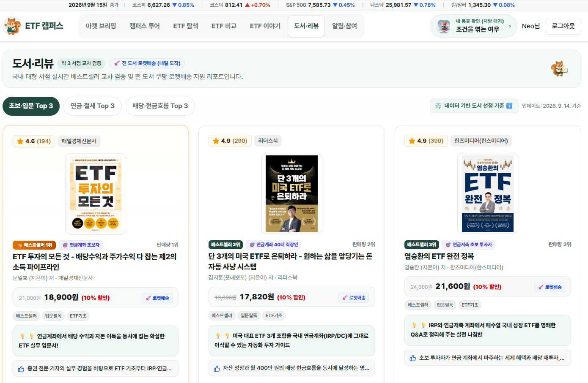

```
분류       초보·입문 Top 3 / 연금·절세 Top 3 / 배당·현금흐름 Top 3
데이터     3대 온라인 서점 평점·리뷰 수 교차 검증
표시       판매량 순위 · 베스트셀러 배지 · 대상 독자 태그 · 할인가 · 배송 연동
```

**제휴 링크를 붙이면 별도 개발 없이 부가 수익이 발생하는 구조입니다.**

**⚠️ 제휴 링크 사용 시 공정거래위원회 추천·보증 심사지침에 따른 대가 표시가 필요합니다.** §10 참조.

---

## 10. 문구 검토 권고 4건

**모두 코드가 아니라 문구 교체입니다.**

```
① 혼합채권 화면      실질 주식 비중 최대 85% 극대화 · 합법적으로 확장할 수 있습니다
   문제            사실은 맞으나 권유의 문장 구조. 한도 우회 안내로 읽힘
   대안            이 유형은 약관상 안전자산으로 분류되며 내부 주식 비중은 40~50%입니다
                   따라서 계좌 전체 주식 노출은 70%를 넘을 수 있습니다
   우선순위         높음

② 성향 진단 헤더     처방 대기
   문제            금융에서 "처방"은 자문 뉘앙스. 진단 본문의 중립 설계와 어긋남
   대안            결과 확인 · 내 유형 보기 · 진단 결과 대기
   우선순위         중간

③ 팩트체크 배지      연말정산 최대 148.5만 원 법정 환급 비법
   문제            세액공제는 공개된 제도이며 비법이 아님. 마케팅 톤
   대안            연말정산 세액공제 한도 정리 · 최대 148.5만 원까지 공제받는 조건
   우선순위         중간

④ 도서 제휴 링크     대가 표시 위치
   문제            공정위 추천·보증 심사지침. 하단 작은 글씨가 아니라 링크 근처여야 함
   우선순위         제휴 개시 전까지
```

**서비스 정체성이 "추천하지 않고 계산한다"이므로, 권유 톤의 문구는 그 정체성과 직접 충돌합니다.**

---

## 11. 용도별 인용 가이드

**지원서·IR 에서 한 장면만 쓴다면**

동종 ETF 비교 화면(§6-2). 같은 지수, 같은 성과, 3.6배 비용 차이가 한 화면에 있습니다.

**기술 차별성을 증명해야 한다면**

자금 순유입 역산(§3-1)과 구성종목 기반 오분류 적발 8건(§7-1). 둘 다 도메인 지식 없이는 나오지 않습니다.

**1인 운영 가능성을 물으면**

매 거래일 자동 생성되는 7단계 브리핑(§3). "매일 하는 일은 검수이지 생산이 아닙니다."

**규제 준수를 물으면**

계좌별 판정 구조(§4)와 판정 근거 조문 기록. 그리고 성향 진단의 중립 설계(§9-2).

**쓰지 말아야 할 것**

```
활성화된 커뮤니티          시드 콘텐츠입니다
월 수만 명 유입            채널은 초기 단계입니다
CAC 0원                  광고비 미집행은 사실이나 다른 주장입니다
0.1초 판정 · 0.3초 로딩    측정 근거가 없습니다
```

---

## 12. 갱신 이력

**v1.0 — 2026-09-16** 최초 작성. 화면 16장 기준. `알림·참여` 메뉴와 전략별 분류 중 TDF·커버드콜·레버리지·신규상장 종목 수는 미수집.
