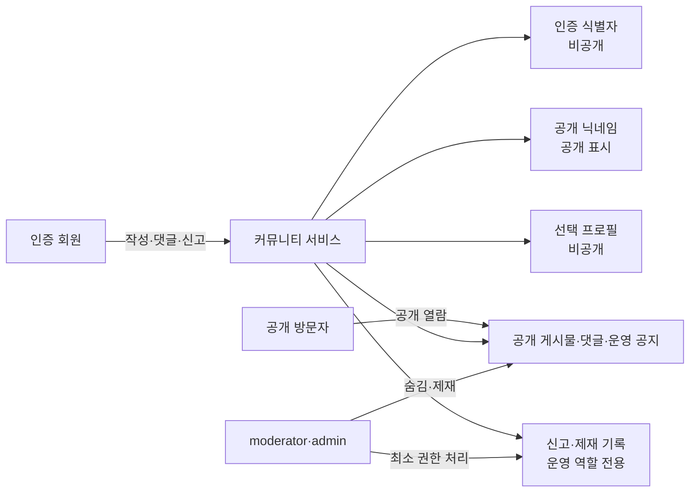

# 개인정보 데이터 맵과 보존·삭제 정책

> **문서 상태:** Phase 1 SSOT · 수집 원칙 확정, 세부 보존 기간은 공개 전 운영자·전문가 승인 필요
> **작성일:** 2026-08-15
> **범위:** 커뮤니티 인증, 프로필, 게시물·댓글, 신고·제재 운영 데이터

## 1. 개인정보 처리 원칙

커뮤니티는 서비스 제공과 안전 운영에 필요한 정보만 수집한다. 회원 식별을 위해 필요한 정보와 공개 프로필 정보를 분리하고, 공개 화면에는 닉네임 외 개인정보를 표시하지 않는다. 개인의 실계좌 잔액, 계좌번호, 거래내역, 주민등록번호, 생년월일, 전화번호는 커뮤니티 목적에 불필요하므로 수집·입력·게시 대상에서 제외한다.

필수 정보는 **이메일 인증 식별자**와 **공개 닉네임**이다. 관심 계좌 유형과 투자 경험 구간은 서비스 제공에 필수로 요구하지 않는 선택 정보다. 연령, 성별, 마케팅 동의는 서비스 이용 필수 정보와 분리하며, Phase 1 커뮤니티에는 이용 자격이나 작성 권한의 조건으로 사용하지 않는다. 비밀번호는 애플리케이션이 직접 저장하지 않는다. 인증 구현은 승인된 인증 제공자의 안전한 인증 플로우를 사용하고, 서비스 DB에는 비밀번호 원문·복호화 가능 값·인증 토큰 원문을 저장하지 않는다.

## 2. 데이터 맵

| 데이터 범주 | 필수 여부 | 처리 목적 | 공개 범위 | 접근 역할 | 수집·입력 경로 | 원칙 |
|---|---:|---|---|---|---|---|
| 이메일 인증 식별자 | 필수 | 인증 회원 식별, 작성·신고 권한 확인, 계정 보호 | 비공개 | 승인된 인증 처리 영역, 제한된 admin | 인증 완료 결과 | 이메일 주소 자체보다 인증 제공자가 반환하는 최소 식별자를 우선 검토한다. |
| 공개 닉네임 | 필수 | 게시물·댓글의 작성자 표시, 커뮤니티 상호작용 | 공개 | guest 포함 전체 이용자 | 가입·프로필 설정 | 실명, 연락처, 계좌·회사 식별을 유도하지 않으며 중복·금칙어 정책을 적용한다. |
| 관심 계좌 유형 | 선택 | 안내·학습 흐름의 선택적 개인화 | 비공개 | member 본인, 필요한 경우 제한된 admin | 프로필 설정 | 예: DC, IRP, 연금저축, 일반계좌. 광고·제휴 타기팅에 사용하지 않는다. |
| 투자 경험 구간 | 선택 | 초급·중급 등 표현 난이도 조정의 선택적 개인화 | 비공개 | member 본인, 필요한 경우 제한된 admin | 프로필 설정 | 금액, 수익률, 보유 종목, 계좌 잔액을 받지 않는다. |
| 게시물·댓글 본문 | 서비스 이용 시 발생 | 질문·답변·학습 기록·오류 제보 | 원칙상 공개 | guest 열람, 작성자 소유권 범위, 운영 역할 | 작성 화면 | 공개 닉네임과 시각만 연결하여 표시한다. |
| 신고 내용 | 서비스 이용 시 발생 | 정책 위반 검토, 안전 보호 | 비공개 | moderator, admin | 신고 화면 | 신고자·신고 내용은 대상 작성자나 일반 회원에게 노출하지 않는다. |
| 제재·운영 처리 기록 | 서비스 운영 시 발생 | 일관성, 이의 처리, 감사 | 비공개 | admin, 위임받은 moderator의 최소 범위 | 운영 도구 | 처리 근거·조치·시각·처리자를 최소한으로 기록한다. |
| 보안·접근 로그 | 서비스 운영 시 발생 | 부정 이용 탐지, 장애·사고 분석 | 비공개 | 제한된 운영 역할 | 서버 운영 | 구체 항목·보존 기간은 인증·인프라 설계 승인 후 최소화한다. |

## 3. 수집 금지 및 공개 금지 데이터

| 구분 | 수집·저장 정책 | 이유 및 처리 원칙 |
|---|---|---|
| 비밀번호 | 직접 수집·저장 금지 | 인증 제공자 또는 승인된 안전 인증 플로우에 맡긴다. |
| 계좌번호·카드번호·계좌 잔액·거래내역 | 수집·게시 금지 | ETF 교육 커뮤니티 운영에 불필요하고 피해 위험이 크다. |
| 주민등록번호·생년월일·전화번호·주소 | 수집·게시 금지 | 본인 확인·연락에 필요한 승인된 별도 근거가 없는 한 처리하지 않는다. |
| 마케팅 동의 | 이용 필수 정보와 분리 | 동의하지 않아도 읽기·작성 등 핵심 커뮤니티 기능을 이용할 수 있어야 한다. |
| 연령·성별 | 기본 수집 금지 | Phase 1의 제품 기능·권한 판단에 필요하지 않다. 추후 연구 목적이 생겨도 별도 목적·동의·보존 정책을 먼저 승인한다. |
| 인증 토큰·비밀키·세션 원문 | 로그·문서·게시물 저장 금지 | 노출 방지와 계정 보호를 위해 마스킹·비밀 관리 체계를 사용한다. |

게시물·댓글에 수집 금지 데이터가 자발적으로 기재된 경우에도 서비스가 이를 정상적인 커뮤니티 데이터로 취급해서는 안 된다. 운영자는 노출을 줄이기 위해 먼저 비공개·숨김을 검토하고, 원문 접근과 추가 보관은 사고 대응에 필요한 최소 범위로 제한한다.

## 4. 보존·삭제·탈퇴 정책

보존 기간은 목적 달성 후 지체 없이 삭제하거나 식별 불가능한 형태로 전환하는 것을 원칙으로 한다. 다만 이용자 요청 처리, 분쟁·사고 대응, 법령상 보존 의무 또는 적법한 권리행사에 필요한 경우에만 예외 보관한다. 예외 보관은 범위·근거·접근권한·종료 시점을 기록하고 정기적으로 재검토한다.

| 데이터 | 정상 이용 중 | 이용자 삭제·철회 요청 | 회원 탈퇴 | 최종 삭제·비식별화 기준 | 상태 |
|---|---|---|---|---|---|
| 이메일 인증 식별자 | 회원 인증·권한에 필요한 기간만 보관 | 필수 정보이므로 계정 유지 중 임의 삭제 시 기능 제한 가능 | 계정 종료 처리 후 삭제 또는 비식별화 | 재가입 유예, 분쟁·법적 보존 필요 여부를 고려한 기간은 공개 전 확정 | **기간 승인 대기** |
| 공개 닉네임 | 계정 활성 기간 동안 표시 | 닉네임 변경 정책은 구현 전 결정 | 탈퇴 후 공개 게시물과의 연결 방식을 결정 | 게시물 삭제·익명화·보존 중 선택지와 기간을 공개 전 확정 | **방식·기간 승인 대기** |
| 선택 프로필 | 회원이 유지하는 동안만 보관 | 회원이 언제든 삭제·수정 가능해야 함 | 탈퇴 시 원칙적으로 삭제 | 백업·캐시 삭제 완료 기한을 포함해 공개 전 확정 | **기본 원칙 확정, 기한 승인 대기** |
| 게시물·댓글 | 공개 서비스 제공 기간 동안 보관 | 작성자 삭제 요청 시 공개 노출을 중단하고 처리 | 탈퇴 후 원문 삭제 또는 익명화 보존 방식을 결정 | 다른 이용자의 인용·신고·분쟁 영향과 공개성의 균형을 검토 | **방식·기간 승인 대기** |
| 신고·제재 기록 | 처리·이의·재발 방지에 필요한 최소 기간 보관 | 일반적인 임의 삭제 대상이 아님 | 회원 탈퇴와 별개로 적법한 운영 목적 범위만 보관 | 보존 근거, 최소 기간, 접근 통제와 파기 절차를 공개 전 확정 | **기간·근거 승인 대기** |
| 보안·접근 로그 | 보안·장애 분석에 필요한 최소 기간 보관 | 개별 삭제 요청은 보안·법적 의무와 함께 검토 | 계정 탈퇴와 별개로 최소 범위 보관 가능 | 로그 항목, 마스킹, 보존 기간, 파기 방법을 공개 전 확정 | **설계 승인 대기** |

### 4.1 공개 전 반드시 확정할 세부 선택지

| 결정 항목 | 선택지 | 운영상 고려점 |
|---|---|---|
| 탈퇴 회원의 공개 콘텐츠 | A. 즉시 삭제, B. 닉네임을 비식별화해 유지, C. 일정 유예 후 삭제 또는 비식별화 | Q&A의 맥락·다른 회원 답변·신고 처리와 개인정보 자기결정권의 균형이 필요하다. |
| 이용자 삭제 요청 처리 | A. 즉시 공개 숨김 후 삭제, B. 정정·이의 유예 후 삭제, C. 법적 보존 대상만 제한 보관 | 원문·백업·검색 인덱스·캐시의 처리 시점을 함께 정의해야 한다. |
| 신고·제재 기록 보존 기간 | A. 고정 기간, B. 사안별 최소 기간, C. 법적 근거별 차등 기간 | 재발 방지와 과잉 보존을 모두 방지해야 한다. |
| 보안 로그 보존 기간 | A. 단기 운영 기간, B. 사고 대응을 포함한 중기 기간, C. 인증 제공자 정책 연동 | 로그 항목 최소화, IP·기기 정보의 처리 근거, 접근 기록이 필요하다. |
| 백업 삭제 반영 | A. 즉시 논리 삭제 후 백업 주기에 맞춰 물리 삭제, B. 별도 파기 주기 운영 | 복구 필요성과 이용자 요청의 실제 반영 시점을 고지해야 한다. |

## 5. 권리 요청과 사고 대응 원칙

회원은 자신의 선택 프로필을 열람·수정·삭제할 수 있어야 한다. 공개 게시물·댓글의 삭제, 닉네임 변경, 탈퇴, 운영 조치 이의 제기 경로는 혼동되지 않도록 분리한다. 요청자는 불필요한 신분증·계좌 정보를 제출하지 않고도, 승인된 인증 상태로 본인 요청을 할 수 있게 설계한다.

개인정보 노출 가능성이 있는 신고가 접수되면 노출 최소화, 접근 통제, 증거 보존의 필요성, 이용자 통지, 재발 방지 순서로 대응한다. 구체적인 통지 기준, 신고 기관·법적 절차, 사고 대응 담당자, 외부 위탁·국외 이전 여부는 인증·DB·호스팅 구조가 확정된 뒤 개인정보 처리방침 및 내부 대응 절차에서 별도 승인한다.

## 6. 구현·운영 전제

개인정보 보호는 UI 문구만으로 충족되지 않는다. 서버에서 역할·소유권을 검증하고, 운영자 접근을 최소 권한으로 제한하며, 입력 검증·출력 인코딩·마크다운 정제·로그 비밀값 마스킹·삭제 작업 검증을 수행해야 한다. 선택 프로필은 개인화에 실제 필요한 경우에만 읽어야 하며, 운영 분석·마케팅·제휴 목적의 재사용은 별도 목적과 동의 없이 수행하지 않는다.

> **법률 유의:** 이 문서는 개인정보 최소화와 운영 설계의 기준이며 법률 자문이 아니다. 실제 서비스 공개 전에는 적용 법령, 인증 제공자·호스팅·백업·위탁 구조, 국외 이전 여부, 보존 기간, 이용자 고지 문안에 대해 자격 있는 개인정보 전문가 또는 법률 검토를 거쳐야 한다.
