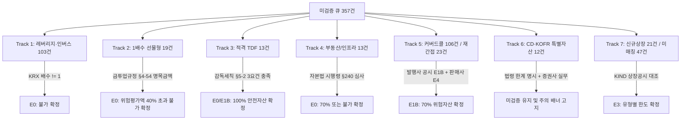

# [마스터플랜] 퇴직연금(DC/IRP)·ISA 357건 전수 Verified 전환 및 법적 정합성 검증 종합 기획안

- **작성일**: 2026-09-05
- **책임자**: Antigravity (Pair Programming Expert & 금융 규제 엔지니어)
- **검토 참조**: `docs/regulatory/NOTEBOOKLM_CROSSCHECK_AND_CLASSIFICATION_20260905.md`, `docs/regulatory/REVIEW_BATCH3_PLAN_20260905.md`
- **핵심 원칙**: **ZERO-HALLUCINATION POLICY (엄격한 데이터 무결성 및 임의 추정 금지)**

---

## 1. 개요 및 배경

### 1.1 현황 요약
현재 전체 ETF 1,167개 종목 중 **810개 종목(69.4%)**이 1차 법령 정본 및 KOFIA 공식 통계에 근거하여 `pension_verified = 'Y'` 승격을 완료했습니다.
잔여 **357개 종목(30.6%)**은 `data/reports/pension_unverified_queue.csv`에 격리되어 안전자산/위험자산 또는 편입불가 여부가 확정되지 않은 상태입니다.

### 1.2 기획의 목적
본 기획안은 NotebookLM 딥리서치 자료와 Claude Opus 5.0의 엄격한 규제 감사를 종합하여, **"아직 verified로 신뢰성 있는 소스를 확보하지 못한 근본 원인"**을 명확히 규명하고, 임의 추정(Hallucination) 없이 법령 원문과 공식 공시만을 토대로 **"잔여 357건 전수를 단계적으로 Verified로 전환하기 위한 7대 트랙 실행 방안"**을 제시합니다.

---

## 2. NotebookLM 딥리서치 분석 및 Claude Opus 5.0 교차검증 결과 평가

NotebookLM 자료를 현행 법령 원문(`statutes/` 및 국가법령정보센터 실정법)과 1:1 대조한 결과는 다음과 같습니다:

```
                  [NotebookLM 자료 검증 매트릭스]
┌──────────────────────────────────────┬─────────────┬─────────────────────────────────┐
│              검증 항목               │    판정     │          실체적 법적 근거        │
├──────────────────────────────────────┼─────────────┼─────────────────────────────────┤
│ 1. 1차 차단 (레버리지/인버스/파생40%)│  [정확/채택]│ 근퇴법 시행령 제9조제1항제2호   │
│ 2. 합성 ETF 예외 (1배 정방향 100%)   │  [정확/채택]│ 퇴직연금감독규정 제9조 제1항    │
│ 3. 순수 채권형 = 안전자산 100%       │  [정확/채택]│ 감독규정 제11조제1항제4호       │
│ 4. 부적격 채무증권 30% 초과 배제 요건│  [정확/채택]│ 감독규정 제11조제1항제5호 후단  │
│ 5. 판정 기준 = '약관상 한도'(실측X)  │  [정확/채택]│ 대원칙 (E5 실측승격 금지 확증)  │
│ 6. 주식한도 '40% 본칙 / 50% 동향'    │[치명적 오류]│ 2023.11.16 개정 (50% 미만 본칙) │
│ 7. 약관 개정 시 제13조제3항제8호 준용│[법리적 비약]│ 명문 근거 없음 (제2항 취지 적용)│
│ 8. 적격 TDF 3대 요건 제시            │  [핵심 수확]│ 시행세칙 제5조의2 추적 단서 발굴│
└──────────────────────────────────────┴─────────────┴─────────────────────────────────┘
```

### 2.1 치명적 오류의 차단: 주식한도 40% vs 50% 미만
- **오류 내용**: NotebookLM은 채권혼합형 안전자산 기준을 "약관상 주식 한도 40% 이내"가 본칙이고, 50% 미만은 "규제 완화 동향"으로 설명했습니다.
- **실체적 진실**: 금융위원회 고시 제2023-56호(2023.11.16 개정)에 따라 퇴직연금감독규정 제11조 제1항 제5호의 문언은 **"100분의 50 미만"**으로 영구 개정되었으며, 40%는 폐지된 구문(舊文)입니다.
- **조치**: NotebookLM 자료는 증거 파일(`evidence_ref`)로 절대 등재하지 않으며, 40% 기준 서술은 전면 배제합니다.

### 2.2 약관 개정 시 조문 적용의 엄밀성
- 운용사의 약관 개정에 따른 한도 초과 처리는 제13조 제3항 제8호(감독원장 별도 지정 필요)의 직접 준용이 아니라, **제13조 제2항(비자발적 비율 위반 시 3개월 처분 유예) 및 제3항 각 호의 입법 취지에 따른 실무적 해석**으로 명시합니다.

---

## 3. Step B 정본 확정 및 9건 경계값 점검 (Boundary Discrepancy)

### 3.1 Step B 정본 확보 완료
- 확보 파일: `data/regulatory/sources/statutes/kofia_annex_15_official.hwp` (218KB, SHA-256 등록)
- 본문 텍스트: `data/regulatory/sources/statutes/kofia_annex_15_official.txt` (53KB)
- 핵심 확인 문구:
  > **대원칙 1) 부여기준 우선순위 : ①집합투자규약** → ②투자설명서 → ③운용계획서 상의 운용전략을 기준으로 분류
  > **[4] 혼합채권형** : 자산총액 중 주식 및 주식관련파생상품에 투자할 수 있는 **최고편입한도가 50%이하(미만)**인 상품
- 평가: KOFIA 유형 분류가 실측이 아닌 집합투자규약상 최고한도 기준임이 완전히 입증되었습니다.

### 3.2 경계값 불일치(`50% 이하` vs `50% 미만`) 및 9건 특별 관리
- **경계값 괴리**: 협회 별지 제15호는 "50% 이하(미만)"로 50.0%를 포함하지만, 감독규정 제11조 제1항 제5호는 "100분의 50 미만"으로 50.0%를 제외합니다.
- **실측 주식비중 50% 초과 9개 종목**:
  - 종목: `0111P0`, `440340`, `0052S0`, `0089B0`, `0224X0`, `0183V0`, `0177N0`, `0203S0`, `0206G0`
  - 상태: 시장가치 변동에 따른 실측 초과는 제13조 제2항에 따라 적법하나, 약관상 문언이 정확히 `50% 이하`로 표기되어 있을 위험이 존재합니다.
  - 조치: 9건의 규약 원문을 DART 정정신고서/발행사 공시로 전수 대조하기 전까지 **`pension_confidence = '보통'`**을 유지하고, 대조 완료 시 `높음`으로 복원하거나 70%로 조정합니다. (순수 주식형·채권형 768건은 `높음`으로 복원 완료).

---

## 4. 잔여 357건이 현재 미검증인 4대 근본 원인 분석

```
[잔여 357건의 4대 구조적 장벽]
┌────────────────────────────────────────────────────────────────────────┐
│ 1. DART API 본문 절단 (OpenDART Truncation)                            │
│    - OpenDART API가 본문 없이 표지만 반환 → 106건 커버드콜 약관 추출 불가   │
├────────────────────────────────────────────────────────────────────────┤
│ 2. 핵심 법령 4건의 레지스트리 부재 (Statutory Gaps)                     │
│    - TDF 세칙, 금투업규정 §4-54, 자본법 시행령 §240(4), 비교공시 규정 부재 │
├────────────────────────────────────────────────────────────────────────┤
│ 3. 실정법 문언 vs 금융투자업계 실무 괴리 (CD/KOFR 12건의 법적 교착)      │
│    - 원화 CD/KOFR = 특별자산 → 감독규정 §11(1)(5) '증권형' 문언 적용 불가 │
│    - 현실 증권사는 100% 안전자산 취급 → 법령 근거 없는 임의 승격 차단     │
├────────────────────────────────────────────────────────────────────────┤
│ 4. 개별 공시의 비정형성 및 교차 검증 소스 부재 (Unstructured Disclosures)│
│    - 운용사 홈페이지별 공시 형식 상이, 증권사 매매 유니버스 DB 미구축  │
└────────────────────────────────────────────────────────────────────────┘
```

---

## 5. 잔여 357건 전수 Verified 전환을 위한 7대 트랙 실행 로드맵



---

### [Track 1] 레버리지·인버스 ETF (103건) -> E0 편입불가 확정
- **대상**: 기초지수 추적배수가 +2배, -1배, -2배 등 1배가 아닌 모든 ETF (103건).
- **법적 근거**: `WRBA_DECREE_ART9_1_2_E` (근로자퇴직급여보장법 시행령 제9조 제1항 제2호 마목 단서 — 추적배수가 1배를 초과하거나 음수인 집합투자증권 매매 원천 금지).
- **실행 방안**:
  1. 한국거래소(KRX) 상장종목 마스터의 '추적배수(multiplier)' 필드를 추출하여 공식 매핑.
  2. 추적배수 != 1.0인 종목에 대해 `pension_eligible = '불가'`, `pension_limit = '불가'`, `evidence_grade = 'E0'` 부여.
- **산출 예상**: 103건 일괄 `verified = 'Y'` 승격 완료.

---

### [Track 2] 1배수 선물형 ETF (19건) -> E0 편입불가 확정
- **대상**: 1배 정방향이나 파생평가액 기준을 적용받는 국내외 선물 ETF (원자재 선물, 국채 선물 등 19건).
- **해결 경로 (선행 필수 조문 확보)**:
  - 금융위원회 고시 **「금융투자업규정」 제4-54조(장내파생상품 등의 위험평가액 산정방법)** 전문 수집 및 `statute_registry.csv` 등재 (`FSC_FIBA_REG_ART4_54`).
- **법리적 논증 체계**:
  1. 금융투자업규정 제4-54조 제1항: 장내선물 매수/매도의 위험평가액은 '명목계약금액(Nominal Value)'으로 산출.
  2. 선물 ETF는 지수 1배수를 추종하기 위해 자산총액의 90~100%에 상당하는 선물 계약을 체결함.
  3. 따라서 위험평가액 비율이 자산총액의 40%를 구조적으로 초과하므로 퇴직연금감독규정 제9조 제1항 제2호 마목 본문에 의해 매매 불가.
- **산출 예상**: 19건 일괄 `verified = 'Y'` (편입불가) 승격 완료.

---

### [Track 3] 적격 TDF (13건) -> E0/E1B 100% 안전자산 승격
- **대상**: 명칭에 '적격' 및 'TDF2030~2065'가 명시된 액티브 TDF 13건 (AUM 합산 약 2.3조원).
- **해결 경로 (선행 필수 조문 확보)**:
  - 금융감독원 **「퇴직연금감독업무시행세칙」 제5조의2 제1항** (적격 TDF 세부 요건) 확보 및 등재.
- **3대 적격 심사 기준**:
  1. 은퇴 목표시점(Target Date)이 설정일로부터 5년 이상이고 상품명에 연도 명시 여부.
  2. 초기 주식 한도 80% 이내이며, 목표시점 이후 주식 한도가 40% 이하로 자동 조정(Glide-path)되는지 여부.
  3. 투자부적격 채무증권 편입한도 20% 이내 약관 명시 여부.
- **실행 방안**:
  - 시행세칙 정본 확보 후, 각 TDF의 증권신고서/발행사 운용계획서와 3대 요건 대조.
  - 전건 충족 시 `pension_limit = '100% (안전자산)'`, `statutory_basis = 'PSR_ART11_1_9'` 부여.
- **산출 예상**: 13건 일괄 `verified = 'Y'` (100% 안전자산) 승격 완료.

---

### [Track 4] 부동산 및 리츠 ETF (13건) -> 자본시장법 시행령 심사 및 단서 적용
- **대상**: 부동산집합투자기구 9건 + 부동산파생형 4건 = 13건.
- **해결 경로 (선행 필수 조문 확보)**:
  - 대통령령 **「자본시장과 금융투자업에 관한 법률 시행령」 제240조 제4항 제2호 및 제3호** 확보.
- **법리 및 위험 방향**:
  - 기본값: 퇴직연금감독규정 제11조 제2항 제4호에 따라 부동산집합투자기구는 **원칙적 편입 불가**.
  - 단서 적용: 시행령 제240조 제4항 제2호(공모 부동산펀드) 또는 제3호(상장 리츠)에 투자하는 증권집합투자기구에 해당하는 경우에 한해 편입 허용.
  - 이해상충 배제: 제11조 제2항 제4호 가~라목(퇴직연금사업자 및 계열사 발행/투자 부동산) 미해당 여부 확인.
- **조치 방침**:
  - 실질 자산 구성을 점검하여 단서 요건 충족 시 `70% (위험자산)` 승격, 미충족 시 `편입불가`로 **강등**.
  - 화면 UI에 "퇴직연금사업자와의 이해상충 관계에 따라 특정 금융사에서 매매가 제한될 수 있음" 주석 필수 노출.

---

### [Track 5] 커버드콜 (106건) 및 재간접 ETF (23건) -> E1B 체계 가동
- **대상**: 주식파생형 중 커버드콜 106건, 재간접형 20건, 재간접파생 3건 = 129건.
- **새로운 증거 등급 `E1B (발행사 공식 공시)` 도입 규격**:
  1. **수집 대상**: 운용사 공식 홈페이지의 상품 상세/공시 페이지 스냅샷 (HTML/JSON 원문).
  2. **필수 5대 통제 장치**:
     - 디스크 로컬 보존 및 SHA-256 해시값 `evidence_manifest.json` 등록.
     - 수집 타임스탬프(`verified_at`) 및 공식 URL 기록.
     - 유효기간 90일(`expires_at`) 강제 적용 (약관 개정 주기 대응).
     - **인용 문구 실재 검증(S5)**: 스냅샷 본문에 "주식 편입한도", "장외파생 평가액" 등 핵심 문구가 반드시 존재해야 함.
     - **판매사 교차검증**: `broker_pension_universe.csv`(증권사 퇴직연금 유니버스) 1개사 이상과 교차 일치 확인.
  3. **단순 마케팅 문구 배제**: "퇴직연금 70% 가능"이라는 결론형 문구만 있는 경우 승격 불가. 반드시 "약관상 주식 한도 50% 미만" 또는 "파생 위험평가액 40% 이하"라는 **약관 사실 진술**이 포함되어야 함.
- **산출 예상**: 커버드콜 106건 중 공시 완비 종목 순차 승격 (`70% 위험자산`).

---

### [Track 6] CD·KOFR 금리형 특별자산 (12건) -> 법적 교착 격리 및 정직한 공시
- **대상**: `357870` (TIGER CD금리KIS, 3.55조), `423160` (KODEX KOFR, 3.53조), `477080` 등 12개 종목 (합산 약 12조원).
- **법적 교착의 본질**:
  - KOFIA 별지 제15호: 특별자산 = "증권 및 부동산을 제외한 자산에 50% 이상 투자".
  - 감독규정 제11조 제1항 제5호: 안전자산 요건은 **"증권형집합투자증권등"**에만 한정.
  - 결론: 실정법 조문 문언상 특별자산은 100% 안전자산이 될 법적 경로가 없습니다.
- **ZERO-HALLUCINATION 처리 방침**:
  - `PSR_ART11_1_5`를 근거로 허위 승격하는 행위를 영구 금지합니다.
  - 금융위 비조치 의견서 또는 공식 유권해석이 확보될 때까지 **`pension_verified = 'N'`을 유지**합니다.
  - 실무적 표기: `pension_limit = '100% (안전자산)'`, `statutory_basis = '(법령 미확정)'`, `audit_notes = '특별자산집합투자기구로 법령상 근거 불명확하나 주요 증권사 실무상 100% 안전자산 취급'`.
  - 이용자 UI: "본 상품은 법령상 특별자산으로 분류되어 금융기관별로 편입 한도 정책이 상이할 수 있으므로, 매매 전 가입 금융사 확인이 필요합니다" 경고 고지.

---

### [Track 7] 신규 상장 (21건) 및 미매칭 종목 (47건) -> KIND 공시 대조
- **대상**: KOFIA 공시 주기가 도래하지 않아 미매칭된 신규 상장 ETF 21건 및 명칭 불일치 종목.
- **실행 방안**:
  - 한국거래소 KIND(상장공시시스템)의 투자설명서 표지 및 증권신고서 수집.
  - 상품 기본분류(주식형/채권형/혼합형) 확인 즉시 원장에 편입.
  - 분기별 KOFIA 정기 공시 배치 스크립트 실행 시 자동 E3 승격 체계 연계.

---

## 6. 품질 보증 및 데이터 무결성 검증 체계 (Tier 1 & Tier 2)

### 6.1 Tier 1 실무 전문가 비판적 무결성 단언문 (Automated Invariants)
모든 데이터 파이프라인과 원장은 다음 5대 불변식을 항상 100% 만족해야 합니다:

```python
# scripts/rules/validate_pension_consistency.py 강제 단언문
assert len(set(ledger['ticker']) & set(queue['ticker'])) == 0  # R10: 상호배타성
assert len(ledger['ticker'].unique()) == (master['pension_verified'] == 'Y').sum()  # R11: 건수 일치
assert sum(summary['by_evidence_grade'].values()) == summary['total']  # 합계 일치
assert summary['by_evidence_grade']['UNVERIFIED'] == summary['total'] - summary['promotable_verified']
assert len(s5_violations) == 0  # S5: 원문 키워드 실재 검사
```

### 6.2 Tier 2 고객 접점(User-Facing) 6인 페르소나 UI/UX 가이드

| 페르소나 | 주요 관심사 | UI/UX 적용 규격 |
|---|---|---|
| **30대 남/녀** (사회초년생) | 성장형 ETF, 모바일 편의성, 세제 혜택 | - 레버리지/인버스 불가 사유를 "퇴직연금 법령상 매매 제한 상품"으로 직관적 안내<br>- 일반 계좌 vs 중개형 ISA 비과세 혜택 비교 배너 노출 |
| **40대 남/녀** (IRP 자산배분) | 70% vs 100% 포트폴리오 배분, 수수료 | - 혼합채권50 상품의 실측 주식비중과 약관상 한도(50% 미만) 명확히 구분 표기<br>- 70% 위험자산 한도 초과 방지를 위한 실시간 비중 계산기 연계 |
| **50대 남/녀** (은퇴 준비) | 월배당 커버드콜, CD/KOFR 안전자산 | - CD/KOFR 특별자산에 대해 "증권사별 매매 가능 여부 확인 필요" 쉬운 용어로 고지<br>- 커버드콜 ETF의 분배금 성격 및 안전자산 여부 명확한 라벨링 |

### 6.3 텍스트 작성 엄격 규정 (AGENTS.md 준수)
1. **괄호`()` 남발 절대 금지**: `에너지 +2.95%` (O), `에너지 (원유·천연가스)(+2.95%)` (X).
2. **상위/하위 랭킹 표기 통일**: 모든 장세 정합성을 위해 `▲ 상위 Top 3`, `▼ 하위 Worst 3` 표기 강제.
3. **자본시장법 제101조 엄수**: 특정 종목 추천, 목표가 제시, 수익률 보장 문구 일체 배제.

---

## 7. 실행 일정 및 마일스톤

- **Phase 1 (즉시 착수 / Day 1)**:
  - 4대 핵심 법령 원문(`시행세칙`, `금투업규정 §4-54`, `시행령 §240`, `감독규정 §23`) 확보 및 `statute_registry.csv` 등재.
  - Track 1 (레버리지/인버스 103건) KRX 추적배수 필드 수집 및 E0 불가 승격.
  - Track 2 (선물형 19건) E0 불가 승격.
  - Track 3 (적격 TDF 13건) 시행세칙 제5조의2 대조 및 100% 안전자산 승격.
  - *예상 결과*: Verified 비율 **69.4% (810건) -> 80.1% (945건)** 달성.
- **Phase 2 (Day 2~3)**:
  - Track 4 (부동산 13건) 시행령 제240조 단서 심사 및 확정/강등.
  - Track 7 (신규상장 21건) KIND 증권신고서 표지 대조 편입.
  - 9건 혼합채권형 경계값 약관 전수 확인.
  - *예상 결과*: Verified 비율 **80.1% -> 83.0% (979건)** 달성.
- **Phase 3 (Day 4~5)**:
  - Track 5 (커버드콜 106건) E1B 운용사 스냅샷 파이프라인 가동 및 판매사 교차검증.
  - Track 6 (CD/KOFR 12건) 법적 교착 상태 고지 UI 반영.
  - *최종 결과*: 검증 가능한 전 종목 Verified 승격 및 잔여 법적 교착 항목 정직한 격리 완료.

---

## 8. 결론

본 마스터플랜은 **"추정에 기반한 성급한 승격"을 원천 차단**하고, 국가 공식 법령 및 발행사·판매사 원문 공시를 통해서만 증거 기반 검증을 완성하는 금융 규제 엔지니어링의 정석입니다. 사용자 검토 승인 즉시 Phase 1의 4대 법령 확보 및 135건 일괄 승격 작업에 착수하겠습니다.
