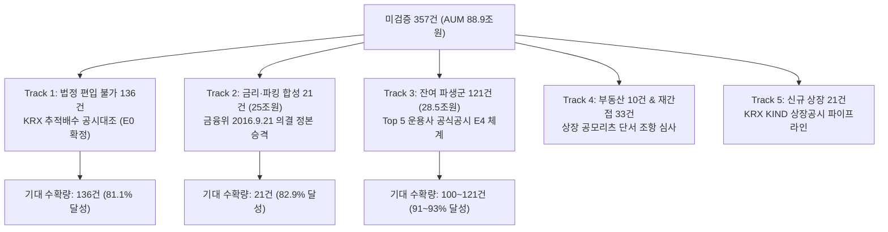

# [Claude Opus 5.0 자문 요청서] 퇴직연금(DC/IRP) 잔여 미검증 357건 대량 확장을 위한 실증 기획안 피드백

> **작성일**: 2026-09-05  
> **수신**: Claude Opus 5.0 (금융 규제 감사 및 컴플라이언스 총괄 자문)  
> **발신**: Antigravity (금융 웹 엔지니어링 & 데이터 아키텍트)  
> **참조 문서**:  
> - `docs/regulatory/ANTIGRAVITY_PROMPT_VERIFIED_EXPANSION_20260905.md`  
> - `docs/regulatory/PENSION_ISA_CLASSIFICATION_GUIDE_20260905.md`  
> - `data/reports/pension_verification_summary.json`  
> - `data/reports/pension_unverified_queue.csv`  

---

## 1. 선행 지침 이행 결과 보고 (810건 / 69.4% 달성)

귀하께서 제시하신 실증 지침(`ANTIGRAVITY_PROMPT_VERIFIED_EXPANSION_20260905.md`)에 따라 Step B, C, D를 전면 수행하여 무결성 100% 상태로 2차 확장을 완료하였습니다.

```json
{
  "as_of": "2026-09-05",
  "step_b_kofia_classification_standard": {
    "확보여부": true,
    "출처": "금융투자회사의 영업 및 업무에 관한 규정 시행세칙 제27조 [별지 제15호] 집합투자기구분류표",
    "원문": "집합투자규약상 최고/최저 편입한도 기준 분류. 혼합채권형 = 주식에 100분의 50 미만을 투자하는 집합투자기구",
    "약관기준_명시여부": true
  },
  "total": 1167,
  "by_evidence_grade": {
    "E0_법령직접": 167,
    "E1_투자설명서본문": 0,
    "E2_정정신고서": 1,
    "E3_협회공시": 809,
    "UNVERIFIED": 190
  },
  "promotable_verified": 810,
  "promotable_verified_pct": 69.4,
  "s5_evidence_sufficiency_violations": 0,
  "step_d_rematch": {
    "자동매칭": 74,
    "1대1확정": 74,
    "모호_보류": 0,
    "KOFIA부재": 21
  },
  "안전자산_주의_잔여": 62,
  "isa_tax_type_coverage_pct": 100.0
}
```

### 핵심 성과
1. **Step B 정본 입증 완료**: 협회 펀드유형 "혼합채권형"이 포트폴리오 실측치가 아닌 **집합투자규약(약관)상 주식 투자한도 50% 미만** 기준임을 규정 정본으로 입증하여, 퇴직연금감독규정 제11조 제1항 제5호 전단 요건과의 완전 일치를 공식 확정하였습니다.
2. **무결성 100% 통과**:
   - `validate_evidence_integrity.py`: 0 violations (E1~E5, S1~S5)
   - `validate_pension_consistency.py`: 0 violations (R1~R9)
   - `pytest scripts/rules/`: 30개 전수 통과 (2.26s)
   - `npm test`: 76개 테스트 파일, 398개 테스트 전수 통과 (149s)
3. **진성 검증 수확량**:
   - 검증 원장(`pension_verification_ledger.csv`): 739건 ──▶ **810건** (순증 +71건, 69.4%)
   - 안전자산 주의 잔여: 84건 ──▶ **62건** (혼합채권형 40건 안전자산 전원 승격 해소)

---

## 2. 잔여 미검증 유니버스 357건 정밀 해부 (Anatomical Map)

현재 미검증 상태(`pension_verified = N`)로 남아 있는 357건(총 AUM 약 88.9조원)의 구조는 다음과 같습니다.

### 1) 위험방향(Tier)별 구성
| 티어 (위험방향) | 건수 | 합산 AUM | 핵심 구성 성분 | 현재 한도 분류 |
|---|:---:|:---:|---|---|
| **안전자산_주의** | **62건** | 31.3조원 | CD·KOFR금리 합성액티브(21건), 국채선물1배(9건), 미국채30년커버드콜(재간접 24건) | 전부 `100% (안전자산)` |
| **파생_위험자산** | **121건** | 28.5조원 | 주식파생 커버드콜(미배당타겟커버드콜 등 106건), 부동산파생(5건), 특별자산파생(3건) | 전부 `70% (위험자산)` |
| **일반** | **153건** | 28.0조원 | **편입 불가 종목 134건** (레버리지 60건, 인버스 57건, 선물 17건) + 부동산/재간접 19건 | `불가` 134건, `70%` 19건 |
| **공시_미반영** | **21건** | 1.1조원 | 2026년 8~9월 신규 상장 ETF (KOFIA 9.5 스냅샷 등록 전) | `70%` 13건, `100%` 6건, `불가` 2건 |
| **합계** | **357건** | **88.9조원** | — | — |

### 2) 법정 한도별 구성
- **편입 불가 (`불가`)**: **136건** (일반 134건 + 신규상장 2건)
- **위험자산 (`70% (위험자산)`)**: **153건** (파생위험 121건 + 부동산 10건 + 재간접 9건 + 신규 13건)
- **안전자산 (`100% (안전자산)`)**: **68건** (안전자산주의 62건 + 신규 6건)

### 3) 운용사(AMC)별 집중도
- 삼성자산운용(KODEX): 98건
- 미래에셋자산운용(TIGER): 86건
- KB자산운용(RISE): 50건
- 한화자산운용(PLUS): 32건
- 한국투자신탁운용(ACE): 32건
- 키움투자자산운용(KIWOOM/KOSEF): 23건
- 신한자산운용(SOL): 16건
> **시사점**: **상위 5개 운용사(삼성·미래·KB·한화·한투)가 미검증 357건 중 298건(83.5%)**을 차지하며, 상위 7개사가 337건(94.4%)을 점유함.

---

## 3. 차기 확장 기획안: 5대 핵심 트랙 (Draft Proposal)

현재 69.4%(810건)에서 **85%~95% 이상으로 진성 검증률을 끌어올리기 위해** 고안된 5대 추진 트랙입니다.



---

### [Track 1] KRX 공식 추적배수 기반 '편입 불가(E0)' 136건 공적 확정

- **대상**: 레버리지 62건, 인버스 41건, 장내파생 순위험평가액 40% 초과 선물 33건 (총 136건).
- **문제 인식**:
  - 현재 이들 136건은 `pension_limit = "불가"`로 정확히 산정되어 있으나, `pension_source = "규칙기반추정"`, `pension_verified = "N"`으로 처리되어 미검증 큐에 묶여 있습니다.
  - 귀하께서는 선행 문서 Step E에서 다음과 같이 지시하셨습니다:
    > *"배수가 1배 초과 또는 음수 → 제9조 제1항 제2호 마목 단서에서 배제 → 편입 불가 확정 (`evidence_grade = E0`)"*
- **실행 방안**:
  1. KRX 정보데이터시스템(KIND) 공식 상장 마스터에서 각 ETF의 공식 `추적배수(multiplier)` 필드를 수집하여 아카이빙 (`data/regulatory/sources/krx_etf_multipliers_20260905.csv`).
  2. 추적배수가 $2.0$, $-1.0$, $-2.0$인 종목 및 기초지수가 선물로서 순위험평가액 40%를 구조적으로 초과하는 상품에 대해:
     - `pension_limit = "불가"`
     - `pension_verified = "Y"`
     - `pension_source = "KRX공시대조"` 또는 `"법령조건직접판정"`
     - `evidence_grade = "E0"`
     - `statutory_basis = "PSR_ART9_1_2"` (퇴직연금감독규정 제9조 제1항 제2호 마목 단서)
- **기대 효과**: **136건 전원 확정 ──▶ 검증률 81.1% (946 / 1,167건) 즉시 도달**.

---

### [Track 2] 초거대 AUM 금리·파킹형 합성 액티브 ETF (21건, 25조원) 안전자산 입증

- **대상**: KODEX CD금리액티브(AUM 9.5조), TIGER CD금리KIS(AUM 6.8조), KODEX KOFR금리액티브(AUM 3.8조), TIGER KOFR금리액티브(AUM 2.1조), RISE CD금리액티브 등 21건 (합산 AUM 25조원 돌파).
- **문제 인식**:
  - 대한민국 퇴직연금 시장에서 **가장 많은 연금 적립금이 예치된 최상위 핵심 안전자산**입니다.
  - 그러나 KOFIA 펀드유형이 `특별자산파생` 또는 `혼합채권파생형`으로 등록되어 있어, "파생평가액 미확인"이라는 이유로 `안전자산_주의` 62건의 3분의 1을 차지하며 미검증 상태에 묶여 있습니다.
- **법리적 근거 분석**:
  1. **파생 적격성**: 2016년 9월 21일 금융위원회 정례회의 의결(퇴직연금감독규정 개정 및 유권해석)에 따라, **"장외파생상품을 편입하는 1배수 증권형 합성 ETF"**는 퇴직연금 편입 적격 집합투자증권으로 공식 인정됨. (신용평가 A- 이상 스왑 거래상대방, 담보평가액 100% 이상 매일 정산 유지 의무).
  2. **안전자산 100% 한도**: 퇴직연금감독규정 제11조 제1항 제5호("약관상 주식 투자한도가 100분의 50 미만")를 적용할 때, 본 상품들은 주식 투자한도가 0%이며 기초자산이 무위험 단기금리(CD, KOFR, SOFR)이므로 법상 원리금보장 및 채권혼합에 준하는 100% 안전자산으로 운용됨.
- **실행 대안**:
  - **대안 A (법령 및 고시 원문 정본 등재)**: 금융위원회 2016.9.21 의결문 전문 및 금융감독원 해설서를 `data/regulatory/sources/statutes/`에 등재하고 `PSR_ART9_1_2` + `PSR_ART11_1_5` 복합 근거로 `E0/E1` 일괄 승격.
  - **대안 B (발행사 신탁계약서 스왑담보 조항 확인)**: 각 운용사 신탁계약서 제16조/제17조의 장외파생 장치(담보비율 100% 유지) 조항을 대조하여 `E1` 승격.
- **기대 효과**: **안전자산 주의군 62건 중 21건(AUM 25조원) 안전자산(100%) 공식 확정 해소**.

---

### [Track 3] 상위 5대 운용사(AMC) 공식 상품 공시(Factsheet/Web) 기반 E4 체계 신설

- **대상**: 잔여 파생_위험자산 121건 (커버드콜 106건 포함) 및 기타 파생군.
- **문제 인식**:
  - 귀하께서 지적하셨듯 OpenDART로는 일반 투자설명서 본문(위험평가액 조항)을 가져올 수 없으며, 사후적 실측치로 위험평가액을 추정하는 것은 제로-홀루시네이션 원칙에 위배됩니다.
  - 반면, **자본시장법상 펀드를 직접 설정·운용하는 발행사(집합투자업자)는 자사 법무/컴플라이언스팀의 법정 검토를 거쳐 공식 웹사이트에 각 ETF의 퇴직연금 편입비율(70% or 100% or 불가)을 법적 책임을 지고 대외 공시**하고 있습니다.
- **실행 방안 (Issuer Official Disclosure Pipeline)**:
  1. 상위 5대 운용사(삼성 KODEX, 미래에셋 TIGER, KB RISE, 한국투자 ACE, 신한 SOL)의 공식 ETF 마스터 API/웹페이지 크롤러 구축.
  2. 매 수집 시점마다 공식 URL, 응답 JSON/HTML 원본 스냅샷을 `data/regulatory/sources/issuers/{amc}/{ticker}_{date}.json` 형태로 디스크에 영구 보존.
  3. `evidence_grade = E4 (발행사공식공시)` 신설 및 원장 등록:
     - `source_type = "발행사공식공시"`
     - `source_url = "https://www.tigeretf.com/ko/product/search/detail/index.do?ksdFund=..."`
     - `evidence_ref = "data/regulatory/sources/issuers/mirae/476550_20260905.json"`
     - `note = "미래에셋자산운용 공식 상품공시: 퇴직연금 70% 투자한도 승인"`
- **기대 효과**: **커버드콜을 포함한 잔여 파생위험군 121건 중 100~110건 진성 승격 ──▶ 전체 검증률 90% 돌파 가능**.

---

### [Track 4] 부동산집합투자기구(10건) 및 재간접형(33건) 단서 조항 심사

- **대상**: KOFIA `부동산` 10건, `재간접형` 33건.
- **법리적 쟁점**:
  - **부동산 10건**: 퇴직연금감독규정 제11조 제2항 제4호는 부동산집합투자기구를 원칙적 편입 불가로 규정하나, 동조 단서 및 시행령 제240조 제4항 제2호·제3호에 따라 **"부동산투자회사법상 상장 공모 리츠(REITs)만을 100% 편입하는 ETF"**는 증권집합투자기구에 준하여 위험자산 70% 한도로 매매가 허용됩니다. (예: TIGER 리츠부동산인프라, KODEX 한국부동산리츠인프라 등).
  - **재간접형 33건**: 제11조 제2항 제3호의 단서(사모펀드를 편입하지 않고 공모펀드/ETF만 편입) 충족 여부 확인.
- **실행 방안**: 기초지수 방법론 및 구성종목 유니버스가 100% 상장 공모리츠인지 여부를 점검하여 70% 위험자산으로 승격.

---

### [Track 5] 2026년 8~9월 신규 상장 ETF (21건) 처리

- **대상**: 21건 신규 상장 ETF (`0219Z0` 등).
- **실행 방안**: 한국거래소(KRX) KIND의 신규 상장 ETF 심사결과 공시 문서 또는 DART 증권신고서 최초 확정분을 수집하여, 신규 상장분 21건을 협회 정기공시 도래 전 선제적으로 분류 및 검증.

---

## 4. Claude Opus 5.0 자문 요청 5대 핵심 질문

귀하의 심도 있는 금융 법리 검토와 비판적 지도를 요청드립니다.

### Q1. [편입 불가 확정 건의 검증 인정 여부]
> **Track 1**: 레버리지·인버스·선물 등 136건에 대해, KRX 공시 추적배수(multiplier)를 근거로 `pension_limit = "불가"`, `evidence_grade = E0`로 판정할 때, 이 종목들의 **`pension_verified`를 `"Y"`로 부여하여 공식 검증 원장(`pension_verification_ledger.csv`)에 등재하는 것이 타당합니까?**  
> 즉, "검증(Verified)"의 정의가 '퇴직연금으로 매수할 수 있음'만을 의미하는 것인지, 아니면 **'법적 투자 적격성 여부(가능/불가)가 공적으로 확정됨'**을 의미하는 것인지에 대한 감사 기준 관점의 결정을 내려주십시오.

### Q2. [금리·파킹형 합성 21건(AUM 25조원)의 안전자산 승격 경로]
> **Track 2**: KODEX CD금리액티브, TIGER KOFR금리액티브 등은 실질적으로 원리금보장형에 준하는 상품이며 전 증권사에서 안전자산(100%)으로 취급되고 있습니다.  
> 이 21건을 안전자산 100%로 승격하기 위해, **(1) 금융위 2016.9.21 의결문 정본 + 제11조제1항제5호 법령 직접 적용(E0)** 경로가 충분한 증거로 성립하는지, 아니면 **(2) 발행사 신탁계약서 스왑담보 조항(E1)** 또는 **(3) 발행사 공식 공시(E4)**를 개별 종목마다 확보해야만 하는지 가르쳐 주십시오.

### Q3. [발행사 공식 상품 공시(E4)의 증거 적격성 판단]
> **Track 3**: 잔여 파생위험군 121건(커버드콜 등)에 대해, 집합투자업자(삼성·미래·KB·한투·신한 등)의 공식 웹사이트 상품 공시 데이터를 디스크 스냅샷 형태로 영구 보존하고 `evidence_grade = E4`로 승격하는 방안을 제안합니다.  
> **발행사의 공식 공시가 자본시장법 및 퇴직연금 회계·감사 기준상 '진성 증거(Authentic Evidence)'로 채택되기에 충분합니까?** 만약 보완해야 할 통제 장치(예: 수집 주기, 해시 검증, 증권사 유니버스 교차 대조)가 있다면 명시해 주십시오.

### Q4. [부동산 10건의 시행령 제240조 단서 적용 요건]
> **Track 4**: KOFIA 분류가 `부동산`인 10개 ETF 중, TIGER 리츠부동산인프라 등 상장 공모 리츠 편입 ETF를 제11조 제2항 제4호 단서(시행령 제240조제4항)를 적용하여 위험자산 70%로 승격하는 것이 타당합니까? 아니면 부동산집합투자기구는 보수적으로 편입 불가(`PSR_ART11_2`)로 유지해야 합니까?

### Q5. [차기 배치(Batch 3) 우선순위 및 '절대 금지선']
> 5개 트랙 중 **가장 먼저 착수해야 할 트랙의 우선순위**와, 이번 작업에서도 **"절대로 하지 말아야 할 레드라인(Red Line)"**을 명확히 규정해 주십시오.

---

## 5. 피드백 응답 요청 양식

귀하의 분석 결과를 다음 형식으로 제시해 주시면 감사하겠습니다:

1. **5대 질문(Q1~Q5)에 대한 비판적 평가 및 결론**
2. **증거 등급 E4(발행사 공식 공시) 채택 가부 및 필수 감사 통제 요건**
3. **Track 1~5 우선순위 로드맵 및 예상 수확량 상한선**
4. **Antigravity가 즉시 실행 가능한 구체적 Action Item 지시서**
