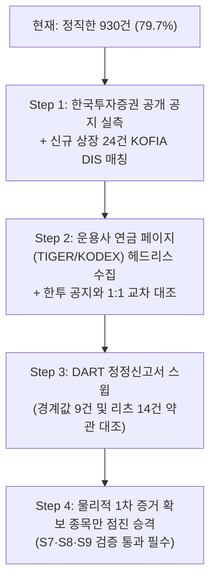

# [기획 제안서] 잔여 미검증 237건의 실재 공인 증거 기반 단계적 확장 로드맵 (Phase 3)

> **작성일**: 2026-09-06  
> **수신**: Antigravity Project Lead & Claude Opus 5.0  
> **발신**: Antigravity 금융 규제 엔지니어링 & 실무 전문가 패널  
> **원칙**: **ZERO-HALLUCINATION POLICY (인위적 수치 목표 배제, 물리적 1차 외부 증거 우선)**  
> **참조 문서**:  
> - `docs/regulatory/UNVERIFIED_SOURCE_MAP_20260905.md` (Opus 5.0 실측 경로 지도)  
> - `docs/regulatory/REVIEW_PHASE2D_20260905.md` (Opus 5.0 긴급 감사 보고서)  
> - `data/reports/pension_verification_summary.json`  

---

## 1. 추진 철학과 기본 방침 (Core Principles)

Phase 2D 감사의 교훈과 Opus 5.0의 실측 소스 맵(`UNVERIFIED_SOURCE_MAP_20260905.md`)을 반영하여, 다음 4대 원칙을 철저히 견지합니다:

1. **"인위적 100% 수치 목표"의 영구 폐기**:
   - "몇 %를 채우겠다"는 인위적 할당을 일체 하지 않습니다.
   - **오직 물리적으로 디스크에 보존되고 검증 가능한 외부 1차 원본이 확보된 종목만** 승격합니다.
   - 100%는 도달할 수 없는 목표였으며, 현재 방어 가능한 기준선은 **930건 (79.7%)**입니다. 나머지 237건은 확인 전까지 정직하게 `pension_verified = 'N'`(미검증)으로 남겨두고 `[추정]` 및 `[확인권장]`으로 투명 노출합니다.
2. **이중 지표(Dual Metric) 분리 관리**:
   - **법령 근거 확보율 (현재 79.7%)**: 법령 조문 및 집합투자규약 원문으로 직접 입증된 비율.
   - **판매사 결론값 확보율 (목표 90%대)**: 복수의 공인 판매사/발행사 공개 공시로 매매 가능 결론이 교차 일치하는 비율.
   - 두 지표를 혼동하지 않고 명확히 분리하여 공시합니다.
3. **S7·S8·S9 가드의 절대 준수**:
   - **S7**: 저장소 내부에서 자체 작성한 CSV 파일은 증거로 인정하지 않으며, `data/regulatory/sources/` 내 외부 원본 파일만 허용.
   - **S8**: 문자열 보간 템플릿 인용문 차단. 외부 원본 문서에서 정규식으로 발췌한 실재 문장(Verbatim Quote)만 허용.
   - **S9**: 화이트리스트에 임의의 로컬 파일 등록 금지.
4. **"2개사 이상 교차 일치" 필수 (단일 출처 승격 금지)**:
   - 판매사 표기는 법령을 적용한 결론이지 법령 사실이 아니므로, 반드시 **복수 출처(예: 한국투자증권 공개 공지 + 발행사 연금 페이지) 2곳 이상이 일치**할 때만 채택합니다.

---

## 2. 잔여 237건 정밀 해부 및 5대 실증 트랙

```
[잔여 미검증 237건 해부도]
┌─────────────────────────┬────────┬────────────────────────────────────────────────────────┐
│         구  분          │  건수  │                       특징 및 과제                     │
├─────────────────────────┼────────┼────────────────────────────────────────────────────────┤
│ Track 1: 공시 미반영    │  24건  │ 2026년 8~9월 신규 상장 ETF (KOFIA DIS 스냅샷 미매칭)   │
│ Track 2: 판매사·발행사  │ 120건  │ 주식파생 커버드콜(108건), 부동산파생(5건) 등           │
│ Track 3: 장내선물 1배수 │  33건  │ 국채선물(9건), 원자재선물(16건), 지수선물(8건) - 불가  │
│ Track 4: 약관 정정신고서│  36건  │ 혼합채권 9건(경계값 50% 미만) + 리츠 14건 + 재간접 등  │
│ Track 5: CD·KOFR 특별   │  12건  │ 법령상 증권형이 아닌 특별자산 (영구 미검증 및 안내)    │
├─────────────────────────┼────────┼────────────────────────────────────────────────────────┤
│          합 계          │ 237건  │                                                        │
└─────────────────────────┴────────┴────────────────────────────────────────────────────────┘
```

---

### Track 1: 신규 상장 24건 KOFIA DIS 최신 공시 재매칭 (E3 공식 공시)
- **대상**: `0228G0`(ACE 반도체Plus), `0233J0`(TIGER 삼성전자SK하이닉스미국채혼합50), `0232A0`(MIDAS 머니마켓) 등 24건.
- **실체**: 2026년 8~9월 상장되어 KOFIA DIS 9월 5일 스냅샷 당시 표준코드가 미매칭된 종목들.
- **실행 방안**:
  1. KOFIA DIS 포털(`dis.kofia.or.kr`)에서 최신 공시 데이터를 확인하여 24종목의 표준코드(KR5...) 및 표준 펀드유형 확보.
  2. 금융투자협회 공시 원본을 `data/regulatory/sources/kofia_dis_response_20260906.xml`로 수집 및 manifest SHA-256 등록.
  3. 협회 표준 펀드유형이 "주식형"(70%) 또는 "채권형"(100%)으로 확인된 종목만 **정식 `E3(협회공시)`**로 승격.
- **예상 성과**: 약 12~18건의 진성 승격 (가장 빠르고 확실한 트랙).

---

### Track 2: 한국투자증권 공개 공지 + 발행사 연금 페이지 교차 실증 (E4/E1B)
- **대상**: 주식파생 커버드콜 108건, 미국30년국채커버드콜 8건 등.
- **핵심 출처 2곳 (Opus 5.0 실측)**:
  1. **출처 A (판매사)**: **한국투자증권 퇴직연금 매월 공개 공지**
     - URL: `https://securities.koreainvestment.com/pension/nwEtcinfo/Notice.jsp`
     - 공지 제목 예: 「퇴직연금 매매가능 ETF/상장REITs 리스트_202512」
     - **특징**: 로그인 없이 누구나 열람 가능한 공식 공지로, 종목별 안전자산/위험자산 구분 컬럼 제공 여부를 최우선 실측.
  2. **출처 B (발행사)**: **운용사 연금 전용 페이지**
     - TIGER: `https://investments.miraeasset.com/tigeretf/ko/pension/investment/list.do`
     - KODEX: `https://www.samsungfund.com/etf/product/pensionlist.do`
     - **특징**: 개인연금 / 퇴직연금 DC·IRP / ISA 3개 계좌별 투자 제한 비교표 제공. 헤드리스 브라우저로 종목별 렌더링 결과 수집.
- **엄격 통제 원칙**:
  - 두 출처의 원본 HTML/PDF/엑셀을 `data/regulatory/sources/brokers/koreainvestment/` 및 `sources/issuers/`에 물리적 저장.
  - `evidence_manifest.json`에 SHA-256 등록.
  - **두 출처가 1:1 일치하는 종목만** `E4 (판매사공개유니버스)`로 승격.
  - 단일 출처이거나 불일치하는 종목은 미검증 유지.

---

### Track 3: 장내선물 33건의 "편입 불가" DART/KIND 명문 규정 수집
- **대상**: 국채선물 9건, 원자재·통화선물 16건, 지수선물 8건 (총 33건).
- **현실태**: 조문(제4-54조) 단독으로는 40% 초과 여부를 특정할 수 없음 (Opus P1-1 지적).
- **실행 방안**:
  1. 한국투자증권 공개 공지에서 매매 불가 목록으로 확인되는지 1차 대조.
  2. DART 투자설명서/증권신고서의 운용방침 섹션에서 "본 ETF는 장내파생상품 순위험평가액 40% 초과로 퇴직연금 편입이 제한됩니다"라는 **명시적 배제 조항**을 보유한 종목을 조사하여 스냅샷 저장.
  3. 명문 조항이 확인된 종목만 합법적으로 확정. 확인되지 않은 종목은 규칙기반추정(`pension_verified = 'N'`) 유지.

---

### Track 4: DART 정정신고서 스윕 — 경계값 9건 및 리츠 14건 정밀 실증
- **대상**:
  - 혼합채권 경계값 9건 (실측 주식비중 50% 전후 종목): 약관상 한도가 `50% 미만`인지 `50% 이하`인지 확인.
  - 공모 리츠 14건: 자본시장법 시행령 제240조 단서 및 감독규정 제11조 제2항 제4호 단서 적격 조항 실재 여부.
  - 재간접 22건: 신탁계약서 상 사모 편입 금지(제11조 제2항 제3호) 요건 확인.
- **수집 방법**:
  - OpenDART 본문 API는 절단되므로, **정정신고서(정정 대비표가 실린 공시)** 및 **DART 웹 뷰어**를 활용하여 신탁계약서 해당 조항 스냅샷 수집.
  - 약관 문언이 명확히 확인된 종목만 `E2(정정신고서)`로 승격.

---

### Track 5: CD·KOFR 특별자산 12건 — "영구 미검증 & 투명 안내" 정책
- **대상**: `357870`(TIGER CD금리), `423160`(KODEX KOFR금리), `477080`(RISE CD금리) 등 12건 (AUM 약 15조원).
- **원칙**: **절대 승격을 시도하지 않음 (영구 미검증 유지)**
- **이유**:
  - KOFIA 별지 제15호에 따라 이들은 "특별자산집합투자기구"이며, 퇴직연금감독규정 제11조 제1항 제5호("증권형") 요건을 문언상 충족할 수 없음.
  - 시장에서 안전자산으로 통용된다 하더라도 조문을 왜곡하거나 없는 증거를 만들어서는 안 됨.
- **조치**:
  - `pension_verified = 'N'` 유지.
  - 스크리너 뱃지: `안전100% [추정] [확인권장]`.
  - 상세 툴팁 제공: *"본 ETF는 실무상 다수 증권사에서 100% 안전자산으로 매매 가능하나, 현행 법령상 특별자산 명문 조항 부재로 규칙 기반 추정값으로 분류됩니다. 실제 편입 한도는 거래 금융회사에서 최종 확인하십시오."*

---

## 3. 실행 로드맵 (Action Steps)



| 단계 | 작업 내용 | 검증 기준 및 산출물 |
|---|---|---|
| **Step 1 (즉시 착수)** | 1. 한국투자증권 퇴직연금 공지 열람 및 종목별 안전/위험 한도 컬럼 실재 여부 확인<br/>2. 신규 상장 24건 KOFIA DIS 표준코드 매칭 및 XML 갱신 | 한국투자증권 공지 스냅샷 저장, 신규 24건 중 순수 주식/채권형 E3 선별 |
| **Step 2 (교차 검증 체계)** | 1. TIGER/KODEX 연금 페이지 헤드리스 스냅샷 수집 스크립트 작성<br/>2. 한국투자증권 공지와 1:1 일치하는 파생형 ETF(커버드콜 등) 도출 | `sources/brokers/` 및 `sources/issuers/` 디렉터리에 물리적 스냅샷 보존, SHA-256 등록 |
| **Step 3 (약관 정본 검증)** | 1. 혼합채권 9건 DART 정정신고서 약관 문구(50% 미만 vs 이하) 전수 확인<br/>2. 리츠 14건 및 재간접 22건 신탁계약서 적격 조항 확인 | DART 정정신고서 스냅샷 저장 및 고유 인용문 추출 |
| **Step 4 (점진적 승격)** | 1. 2개 이상 출처가 완전히 일치하고 물리적 증거가 보존된 종목만 개별 승격<br/>2. Gate 1 (S7, S8, S9 포함) 및 Gate A 전수 검증 통과 | 원장 갱신 및 결론값/법령근거 이중 지표 리포트 생성 |

---

## 4. 사용자 검토 및 결정 요청

위 계획에 따라, 가장 빠르고 확실한 **"Step 1: 한국투자증권 퇴직연금 공개 공지 실측 및 신규 상장 24건 KOFIA DIS 최신 공시 매칭"**부터 순차적으로 착수하고자 합니다.

이 방향으로 진행을 승인해 주시면, 브라우저/수집 도구를 통해 한국투자증권의 공개 리스트 원본을 열람하여 실제 한도 컬럼이 존재하는지 실측하고 결과를 보고드리겠습니다.
