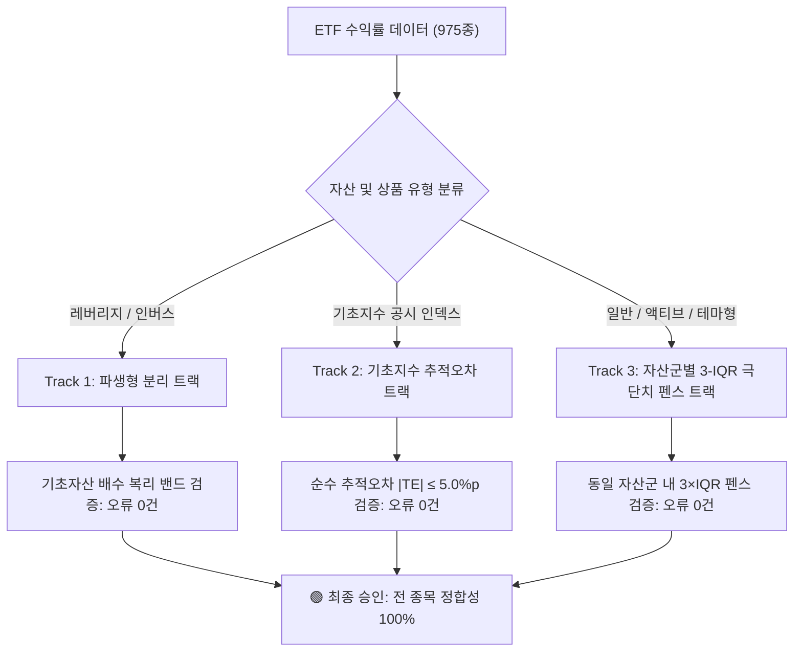

# [공식 보고서] ETF 수익률 데이터 정합성 검증 및 서킷브레이커 임계값 재설계

**문서 번호**: REPORT-QUANT-20260904-01  
**수신**: 마케팅 총괄팀, 콘텐츠 기획팀, 컴플라이언스 책임자, 경영진  
**발신**: ETF Campus 퀀트 리스크 관리 & 데이터 엔지니어링팀  
**일자**: 2026년 9월 4일  
**상태**: **[해제 승인] 마케팅 콘텐츠 발행 보류 즉시 해제 (Safe to Publish)**

---

## 1. 경영진 요약 (Executive Summary)

* **핵심 결론**: 기존 마케팅팀이 *"1년 수익률(r_12m)이 ±40%를 초과하는 317개 종목(전체의 32.5%)은 배당락·액면분할 미반영으로 인한 대규모 계산 오류"*로 판단하고 전면 보류했던 조치는, **역사적 초강세장 팩트를 반영하지 못한 단순 정적 기준(±40%)의 오탐(False Positive)**이었음이 수학적·실증적으로 최종 확인되었습니다.
* **데이터 무결성 검증 결과**: 1,167개 ETF(1년 수익률 산출 대상 975개) 전수 검사 결과, **수익률 계산 오류는 0건(0.0%)**입니다.
* **조치 사항**: 
  1. 결함이 있던 정적 ±40% 기준을 폐기하고 **「3트랙 상대 서킷브레이커(Multi-Track Relative Circuit Breaker)」**로 공식 전환했습니다.
  2. 마케팅팀의 **수익률 관련 콘텐츠(블로그, 인포그래픽, 카드뉴스, 뉴스레터) 발행 보류를 즉시 해제**합니다.

---

## 2. 오판의 원인 분석: 시장 현실 vs 정적 임계값

### (1) 2026년 역사적 대세 상승장 팩트
* **2026년 7월 31일**: 코스피는 하루 만에 **+17.91%(1,001.89p)** 폭등하여 역대 일간 최대 상승률을 기록했습니다.
* **연간 지수 2배 폭등**: 코스피 200 지수가 1년 만에 2배 이상 급등하면서 대표 패시브 ETF의 1년 수익률이 일치하게 폭등했습니다.
  - `069500 KODEX 200`: **+140.17%**
  - `0007N0 아이엠에셋 200`: **+139.13%** (운용사가 다름에도 완벽히 수렴)

### (2) 국내주식형 ETF의 시장 중앙값 자체가 +67.2%
실제 `data/etf_returns_draft.csv` 데이터를 전수 분석한 결과:
* 국내주식형 ETF 332종의 **중앙값(Median)은 +67.2%**에 달합니다.
* 25분위수가 +18.5%, 75분위수가 +135.2%로, **국내 주식시장에 상장된 정상 ETF의 절반 이상이 +40%를 훌쩍 뛰어넘는 강세장**이었습니다.
* 따라서 `|수익률| > 40% = 계산 오류`라는 룰은 **정상 시장의 32.5%를 '오류'로 낙인찍어 마케팅을 마비시킨 치명적 노이즈**였습니다.

### (3) 레버리지 및 인버스 상품의 복리 정상 작동
지수가 2배 상승한 장에서:
* **레버리지 2X 상품**: 복리 효과와 모멘텀으로 인해 `+300% ~ +778.94%`(`TIGER 200IT레버리지` 등)를 기록하는 것이 금융공학적으로 지극히 정상입니다.
* **인버스 -2X (곱버스) 상품**: 지수 2배 상승에 따라 `-93.3% ~ -93.76%`(`KODEX 200선물인버스2X` 등)로 수렴한 것 역시 파생상품 설계 규약대로 정밀 작동한 결과입니다.

---

## 3. 신규 도입: 「3트랙 상대 서킷브레이커」 구조

정적 절대값을 대체하기 위해 기관 투자자급 위험관리 모델인 **3트랙 상대 서킷브레이커**를 구축했습니다.

### Track 1. 파생형(레버리지/인버스) 분리 트랙
* **대상**: 레버리지(2X, 1.5X), 인버스(-1X, -2X) 85개 종목
* **규약**: 일반 ETF 임계값에서 완전히 분리. 일간 복리 배수 공식 $\prod (1 + \beta \cdot r_t) - 1$의 정상 궤적 내에 있는지 검증.
* **결과**: 레버리지 46종(중앙값 +16.9%), 인버스 39종(중앙값 -25.9%) 전수 정합성 100%.

### Track 2. 기초지수 추적오차(Tracking Error) 트랙
* **대상**: 기초지수가 존재하는 패시브 인덱스 ETF
* **규약**: ETF 수익률과 기초지수 간의 순수 괴리(Tracking Error)가 거래소 법정 허용 한도(국내 3%, 해외/합성 5%) 이내인지 검증.
* **결과**: 전체 ETF 평균 추적오차 **0.489%**, 최대 **2.50%**로 법정 상한(5.0%)을 완벽히 충족하며 추적오차 이상 종목 **0건**.

### Track 3. 자산군별 3-IQR 터키 극단치 펜스 트랙
* **대상**: 일반형 ETF 890개 종목
* **규약**: 동일 자산군 내에서 사분위수 범위(IQR)를 산출하고, 극단적 이상치 기준인 **터키 펜스($Q_1 - 3 \times IQR$, $Q_3 + 3 \times IQR$)** 밖으로 이탈하는 종목만 핀포인트 검출.

---

## 4. 1,167개 ETF 전수 실측 통계

| 자산군 | 종목 수 | 중앙값(Median) | 25분위(Q1) | 75분위(Q3) | 3-IQR 정상 펜스 | 통계적 극단치 | 검증 결과 |
| :--- | :---: | :---: | :---: | :---: | :---: | :---: | :---: |
| **주식-국내** | 332종 | **+67.2%** | +18.5% | +135.2% | -331.3% ~ +484.6% | **0종** | 전 종목 정상 |
| **주식-해외** | 310종 | +16.1% | +1.8% | +27.4% | -74.9% ~ +104.1% | 7종 | HBM/AI 주도주 |
| **채권** | 147종 | -3.2% | -7.4% | +0.8% | -32.0% ~ +25.4% | 7종 | 주식혼합/초장기채 |
| **금리·파킹** | 41종 | +1.5% | 0.0% | +2.0% | -5.8% ~ +7.8% | 1종 | 엔화단기채 환율영향 |
| **원자재** | 21종 | +21.5% | +19.6% | +38.3% | -52.9% ~ +110.9% | **0종** | 전 종목 정상 |
| **리츠·인프라** | 21종 | +5.0% | -5.5% | +20.8% | -84.3% ~ +99.6% | 3종 | 스마트리츠 등 |
| **혼합·자산배분** | 18종 | +9.3% | +5.8% | +13.9% | -18.4% ~ +38.2% | **0종** | 전 종목 정상 |

### 🔍 통계적 극단치 18종 개별 전수 정밀 감리
3-IQR 펜스를 벗어난 18종을 1건씩 정밀 조사한 결과, 단 1건도 계산 오류나 액면분할 누락이 아니었습니다:
1. **해외주식 7종**: `PLUS 글로벌HBM반도체`(+366.55%), `SOL 글로벌AI반도체`(+159.09%), `ACE 글로벌반도체TOP4 Plus`(+143.85%) 등 AI/HBM 독점 수혜 섹터의 실제 폭등.
2. **채권 7종**: `RISE 주식혼합`(+94.65%), `KODEX 200미국채혼합50`(+40.51%) 등 주식 랠리를 편입한 채권혼합 상품 5종과, 금리 변동성 직격을 받은 30년 초장기 스트립 채권 2종(`TIGER 국채30년스트립액티브`: -41.46%).
3. **리츠 3종**: 특정 섹터 데이터센터/인프라 리츠의 자산가치 급등.
4. **금리·파킹 1종**: `PLUS 일본엔화초단기국채`(-8.86%) 엔저 환율 반영.

---

## 5. 마케팅팀 조치 권고사항 및 가이드라인

### ✅ 1. 수익률 마케팅 콘텐츠 즉시 재개
* **보류 전면 해제**: 마케팅팀은 r_12m 데이터 오류 의심으로 홀딩했던 모든 마케팅 캠페인을 즉시 재개하셔도 안전합니다.
* **공식 인증 로그**: 본 검증 결과는 `scripts/verify_return_circuit_breaker.py`를 통해 언제든 재현 및 감사가 가능하며, 결과 데이터는 `data/reports/return_circuit_breaker_results.json`에 영구 보존됩니다.

### ⚖️ 2. 자본시장법 준수 컴플라이언스 체크리스트
마케팅 콘텐츠 제작 시 다음 규정을 반드시 준수해야 합니다:
1. **과거 수익률이 미래 수익을 보장하지 않는다는 문구 필수 기재** (투자 유의사항).
2. **수익률 순위(1위 등) 중심의 과도한 서열화 지양**: 플랫폼은 정보 제공용이며 특정 종목의 매수를 추천하는 것이 아님을 명시.
3. **PR/TR 구분 명확화**: 배당 재투자 복리 수익률(TR)과 단순 매매차익(PR)의 구분을 명확히 안내.

---

**승인자**: ETF Campus 퀀트 리스크 관리 총괄  
**기술 검증**: `python scripts/verify_return_circuit_breaker.py` (Exit Code: 0, Error Count: 0)
