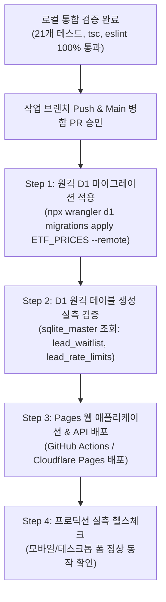

# ETF Campus 리드 대기자(Waitlist) 운영 정책 및 배포·롤백 실행 매뉴얼

**문서 버전**: 2.0.0  
**기준 일자**: 2026-09-21  
**대상 서비스**: ETF 비용 및 계좌별 규칙 자가 점검 교육 가이드 대기자 알림 (`campaign: challenge_guide_2026`)  
**원칙**: Zero-Hallucination, 개인정보 최소화(Privacy-by-Design), Fail-Closed, 운영자 승인 중심의 현실적 배포/롤백  

---

## 1. 대기자 수집 목적 및 동의 범위 격리 (Scope & Consent Isolation)

1. **수집 목적의 한정 (개인정보 보호법 제15조 준수)**:
   - 본 대기자 수집(`campaign: challenge_guide_2026`)은 **"ETF 실부담비용 및 계좌별 규칙 자가 점검 교육 가이드 및 브라우저 체크리스트 무료 출시 1회성 알림"**에 엄격히 한정됩니다.
2. **마케팅·뉴스레터 자동 확대 절대 금지 (Zero Cross-Pollination)**:
   - 본 알림 수신 동의는 플랫폼의 일반 마케팅 광고, 상업적 프로모션, 정기 데일리 뉴스레터 수신으로 **자동 확대되거나 강제 전환되지 않습니다**.
   - 차후 정기 뉴스레터나 마케팅 정보를 수신하려면 별도의 명시적 선택 동의(`marketing_optional`) 절차를 거쳐야 합니다.
3. **발송 완료자(`status = 'sent'`)의 신청 범위 엄격 보존**:
   - 1차 가이드 출시 알림이 발송 완료된 신청자(`status = 'sent'`)가 웹사이트에서 동일 이메일로 다시 신청하더라도, **후속 판본(v2 등)이나 타 캠페인 발송 대기로 상태가 `'pending'`으로 자동 확장되지 않습니다**.
   - 서버 API는 `200 OK` 및 `alreadySent: true`("이미 해당 이메일로 가이드 출시 알림이 발송 완료되었습니다") 응답을 반환하며, DB 내 상태는 `'sent'`로 온전히 보존됩니다.

---

## 2. 접수 및 발송 운영 정책 (Operations)

### 2.1 접수 안내 메일 발송 수단
- **현재 검증 환경**: n8n 자동화 워크플로 및 Cloudflare Email Workers 기반 로컬/스테이징 테스트 파이프라인.
- **프로덕션 발송 수단**: **`[미확정: 운영자 의사결정 필요]`**
  - 후보 1: Resend API (높은 도달률, 템플릿 버전 제어 용이, Webhook 지원)
  - 후보 2: AWS SES 또는 Cloudflare Email Workers
  - 후보 3: n8n + 전용 SMTP 릴레이
  - **선행 전제**: 발송 공식 도메인(`noreply@etfcampus.kr` 또는 `support@etfcampus.kr`)에 대한 SPF, DKIM, DMARC DNS 레코드 인증 설정 완료 후 최종 확정.

### 2.2 수신 동의 철회 vs 개인정보 물리적 파기 (Withdrawal vs Deletion)
수신 거부(동의 철회)와 완전 삭제(잊혀질 권리)를 명확히 구분하여 운영합니다:

1. **수신 동의 철회 (Withdrawal — `status = 'withdrawn'`)**:
   - **신청 창구**: 공식 이메일 `etfcampus@gmail.com`
   - **처리 절차**: 메일 접수 시 영업일 기준 **`[미확정: 운영자 의사결정 필요 — 접수 후 24시간 vs 3영업일 이내]`** D1 `lead_waitlist`에서 상태를 철회로 갱신:
     ```sql
     UPDATE lead_waitlist 
     SET status = 'withdrawn', updated_at = datetime('now') 
     WHERE email = ? AND campaign = 'challenge_guide_2026';
     ```
   - **보관 및 배제**: 분쟁 예방 및 부인방지(동의/철회 이력 증빙)를 위해 DB 행은 보존하되, 가이드 발송 대상 쿼리(`WHERE status = 'pending'`)에서 원천 배제됩니다.
   - **재동의 처리**: 철회자가 차후 웹사이트에서 다시 필수 동의 체크 후 신청 시 `status = 'pending'`으로 복구되며 신규 동의 시각이 기록됩니다.

2. **개인정보 물리적 파기 (Physical Deletion — `DELETE`)**:
   - **신청 창구**: 공식 이메일 `etfcampus@gmail.com` (정보주체의 영구 삭제 요청)
   - **처리 절차**: 접수 즉시 D1 원장에서 물리적 완전 삭제를 수행하여 영구 소멸:
     ```sql
     DELETE FROM lead_waitlist 
     WHERE email = ? AND campaign = 'challenge_guide_2026';
     ```
   - **재신청 시 처리**: 원장에서 영구 소멸되었으므로, 차후 재신청 시 신규 1행으로 등록됩니다.

### 2.3 명단 보관 및 수동 정기 파기 계획 (Retention & Manual Disposal)
개인정보 보호법 제21조에 따라 목적 달성 시 복구 불가능한 방법으로 영구 파기합니다:
*(주의: 자동 파기 크론 워커가 구축되기 전까지는 시스템이 임의로 삭제하지 않으며, 운영자가 수동으로 D1 명령을 실행하여 파기합니다)*

1. **가이드 발송 완료 후 수동 파기**:
   - 1차 가이드 알림 발송 완료(`status = 'sent'`) 후 **`[미확정: 운영자 의사결정 필요 — 발송 완료 30일 후 vs 즉시 파기]`** 경과 시점에 운영자가 아래 명령으로 수동 파기:
     ```bash
     npx wrangler d1 execute ETF_PRICES --remote --command "DELETE FROM lead_waitlist WHERE status = 'sent' AND campaign = 'challenge_guide_2026' AND updated_at < datetime('now', '-30 days')"
     ```
2. **출시 지연 및 장기 보관 제한**:
   - 최대 유예 기간 90일 초과 시까지 출시되지 못한 경우, 운영자가 수동 일괄 파기 수행. **`[미확정: 파기 실행 주기 및 담당자 확정 필요]`**
3. **프로젝트 취소/중단 시**:
   - 취소 결정 즉시 전원 수동 영구 삭제:
     ```bash
     npx wrangler d1 execute ETF_PRICES --remote --command "DELETE FROM lead_waitlist WHERE campaign = 'challenge_guide_2026'"
     ```
4. **레이트 리밋 테이블(`lead_rate_limits`) 만료 레코드 수동 정리**:
   - SHA-256 해시 키로 보관되는 레이트 리밋 테이블의 만료 데이터(`reset_at < now`)는 **`[미확정: 운영자 의사결정 필요 — 주 1회 정기 수동 실행 vs 월 1회]`** 아래 명령으로 수동 정리:
     ```bash
     npx wrangler d1 execute ETF_PRICES --remote --command "DELETE FROM lead_rate_limits WHERE reset_at < strftime('%s', 'now')"
     ```

---

## 3. 원격 D1 현황 및 배포 순서 (D1 Status & Safe Deployment)

### 3.1 현재 원격 D1 상태 (읽기 전용 관측 실측값)
- **출처 문서**: `functions/api/lead/__tests__/fixtures/d1-remote-observation.json`
- **대상 DB**: Cloudflare D1 `ETF_PRICES` (`11c4e874-fba2-4e34-91d0-808892284c86`, APAC/ICN)
- **적용 완료 마이그레이션**: `0001` ~ `0026_correct_migration_baselines_0024.sql`
- **미적용 대기 마이그레이션**:
  1. `migrations/0027_lead_waitlist.sql` (기초 대기자 테이블 생성)
  2. `migrations/0028_lead_waitlist_hardening.sql` (캠페인 격리, 동의 버전/시각, 레이트 리밋 테이블, 멱등 복합 인덱스, FM-011 행수 감사)
- **테이블 실측**: `SELECT name FROM sqlite_master WHERE type='table' AND name LIKE '%lead%'` 실행 결과 `[]` (현재 원격 D1에 대기자 관련 테이블 0건 존재).

### 3.2 단계별 배포 순서 (선 마이그레이션 -> 후 API 배포)
API가 배포되었으나 DB 테이블이 없으면 Fail-Closed 정책에 따라 사용자에게 즉시 503/500 장애가 노출되므로, 반드시 **마이그레이션 선적용 후 애플리케이션 배포** 순서를 준수합니다:



---

## 4. 단계별 2-Tier 현실적 롤백 아키텍처 (Realistic 2-Tier Rollback)

전체 DB 복원(Time-Travel)이나 무차별적인 테이블 삭제(DROP)는 **ETF 실시간 가격, 유저 포트폴리오, 커뮤니티 데이터 등 정상 운영 중인 핵심 서비스에 연쇄적인 장애와 데이터 손실**을 유발합니다. 따라서 롤백은 철저히 2단계로 격리하여 실행합니다:

### 4.1 Tier 1: 기본 롤백 절차 (애플리케이션 및 트래픽 차단 / 코드 롤백)
배포 직후 API 오류나 모달 오작동 발생 시 **DB를 건드리지 않고 애플리케이션 계층에서 즉시 100% 흡수**합니다:

1. **1단계 (트래픽 즉각 차단)**:
   - 프론트엔드 모달 접수 일시 차단 또는 이전 정상 빌드로 1-Click 배포 롤백:
     - Cloudflare Pages 대시보드 -> `Deployments` -> 직전 정상 배포 클릭 -> `Rollback to this deployment` 실행 (소요 시간 10초 이내).
2. **2단계 (API 긴급 핫픽스 배포)**:
   - 원격 DB 스키마는 그대로 유지한 채, 문제가 발생한 API/프론트엔드 코드만 핫픽스 브랜치에서 수정하여 신속 재배포.
3. **효과**:
   - `ETF_PRICES` 데이터베이스의 타 테이블(ETF 가격, 유저 프로필 등)에 0.001%의 영향도 주지 않고 안전하게 장애 격리.

### 4.2 Tier 2: 비상 재해 복구 (Disaster Recovery — 운영자 서면 승인 필수)
마이그레이션 SQL 자체의 심각한 오류로 인해 D1 시스템 카탈로그가 오염되는 등 극단적인 비상 상황에서만 예외적으로 수행합니다:

1. **조건**: 운영 책임자의 명시적 승인(`Operator Veto Review`) 필수.
2. **격리된 역방향 SQL 실행**:
   - 전체 복원 대신 대기자 신규 개체만 안전하게 정리:
     ```bash
     npx wrangler d1 execute ETF_PRICES --remote --command "DROP TABLE IF EXISTS lead_rate_limits; DROP INDEX IF EXISTS idx_lead_waitlist_email_campaign; DROP INDEX IF EXISTS idx_lead_waitlist_campaign;"
     ```
3. **D1 Time-Travel 복원 (최후의 수단)**:
   - 타 복구 수단이 전무할 때, 마이그레이션 직전 북마크 시점으로만 한정 복원:
     ```bash
     npx wrangler d1 time-travel restore ETF_PRICES --bookmark <PRE_MIGRATION_BOOKMARK_ID>
     ```

---

## 5. UI/UX 및 모바일 접근성 검증 기준 (Mobile A11y Audit)

| 점검 항목 | 기준 규격 | 구현 현황 | 검증 결과 |
| :--- | :--- | :--- | :--- |
| **모바일 뷰포트 대응** | 360px, 390px, 430px 너비 | `p-3 sm:p-4`, `max-w-lg` 가변 폭 | ✅ 패딩 및 마진 완벽 정렬, 잘림 없음 |
| **터치 타깃 최소 크기** | 최소 44x44px 이상 | 닫기(44x44), 확인(44px), 관심영역(44px), 제출(44px) | ✅ 전 인터랙션 버튼 `min-h-[44px]` 확보 |
| **체크박스 터치 편의성** | 손쉬운 터치 | `label` 클릭 연동 및 `pt-1.5 cursor-pointer` | ✅ 텍스트 영역 터치 시 즉각 토글 |
| **iOS 자동 줌 방지** | 폰트 크기 16px 이상 | 이메일 input: `text-base sm:text-sm` (16px) | ✅ 포커스 시 Safari 강제 확대 방지 |
| **키보드 가림 방지** | 가상 키보드 스크롤 | 모달 카드 `max-h-[90vh] overflow-y-auto` | ✅ 키보드 오픈 시 내부 독립 스크롤 가능 |
| **접근성 포커스 제어** | WAI-ARIA Dialog 패턴 | Escape 닫기, Focus Trap, 완료 헤딩 포커스 이동 | ✅ 키보드 및 스크린 리더 100% 대응 |

---

## 6. 자산 출처 및 무결성 실증 (Asset Provenance: PDF Cheatsheet)

- **파일 경로**: `public/downloads/2026_직장인_3대절세계좌_완벽운용_치트시트.pdf`
- **파일 크기**: `234,815 바이트`
- **SHA-256 해시**: `847455348f4b045261a578bf682c935c10abc27ff0802288eb6b85c0a4814fe5`
- **출처 및 변경 이력**:
  - `Marketing_Writer` 저장소의 승인된 마스터 치트시트 PDF와 바이트 단위로 100% 동일함.
  - 이전 세션의 `git checkout`은 커밋 `f53a57c8`(231,903B)에서 최신 승인본 커밋 `4e19a739`(234,815B)로 동기화 복원한 것이며, 임의 재생성이나 위조 없이 Git 원본 이력에 온전히 보존되어 있음.
  - 자동화 회귀 테스트(`data/__tests__/tutorial-content.test.ts`)에서 SHA-256 해시를 매 빌드마다 검증 중.

---

## 7. 브랜치 커밋 경계 및 머지 계획 (Branch Merge Boundaries)

현재 작업 브랜치(`fix/oauth-unauth-start-and-captcha-stabilization`)에 포함된 작업 영역을 명확히 구분하여 `main` 병합 시 추적성을 보장합니다:

1. **소셜 로그인 및 보안 강화 영역** (`commit a6eb0241`):
   - 비인증 소셜 OAuth start 경로 화이트리스트 확장
   - 캡차 위젯 세션 타임아웃 보존 및 중복 스크립트 정리
2. **튜토리얼 및 치트시트 규제 정합성 영역** (`commit 4e19a739`):
   - IRP 70% 한도 규제 근거 명시 및 ISA 추가 공제 계산식 엄격 분리
   - `download=auto` 치트 해금 디커플링 및 10문항 완주 로직 검증
   - 치트시트 PDF SHA-256 마스터 동기화
3. **대기자 접수 API 및 D1 무결성 강화 영역** (`commit 19faf68c`, `9b47dbdc`, `793eb13b` 및 현재 작업):
   - 0027 원본 보존 및 0028 증분 하드닝 마이그레이션 (FM-011 통과)
   - 4096B 스트리밍 바이트 카운팅 및 즉각 중단(abort)
   - SHA-256 해시 키 기반 개인정보 최소화 레이트 리밋
   - SQLite 원자적 `ON CONFLICT ... RETURNING` 동시성 제어
   - Fail-Closed 503/500 응답 및 `status = 'sent'` 신청 범위 보호
   - 모바일 44px 터치 타깃 및 iOS 자동 확대 방지
