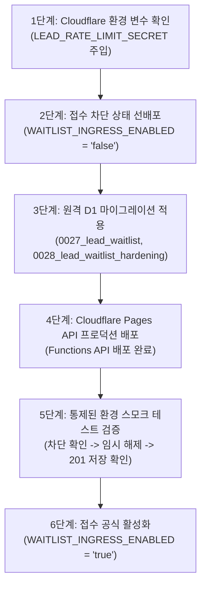

# ETF Campus 리드 대기자(Waitlist) 운영 정책 및 배포·롤백 실행 매뉴얼

**문서 버전**: 2.2.0  
**기준 일자**: 2026-09-22  
**대상 서비스**: ETF 비용 및 계좌별 규칙 자가 점검 교육 가이드 대기자 알림 (`campaign: challenge_guide_2026`)  
**원칙**: Zero-Hallucination, 개인정보 최소화(Privacy-by-Design), Fail-Closed, 지체 없는 즉시 파기, 운영자 확정 중심의 현실적 배포/롤백  

---

## 1. 대기자 수집 목적 및 동의 범위 격리 (Scope & Consent Isolation)

1. **수집 목적의 한정 (개인정보 보호법 제15조 준수)**:
   - 본 대기자 수집(`campaign: challenge_guide_2026`)은 **"ETF 실부담비용 및 계좌별 규칙 자가 점검 교육 가이드 및 브라우저 체크리스트 무료 출시 1회성 알림"**에 엄격히 한정됩니다.
2. **마케팅·뉴스레터 자동 확대 절대 금지 (Zero Cross-Pollination)**:
   - 본 알림 수신 동의는 플랫폼의 일반 마케팅 광고, 상업적 프로모션, 정기 데일리 뉴스레터 수신으로 **자동 확대되거나 강제 전환되지 않습니다**.
   - 차후 정기 뉴스레터나 마케팅 정보를 수신하려면 별도의 명시적 선택 동의(`marketing_optional`) 절차를 거쳐야 합니다.
3. **발송 완료자(`status = 'sent'`)의 신청 범위 및 상태 엄격 보호**:
   - 1차 가이드 출시 알림이 발송 완료된 신청자(`status = 'sent'`)가 웹사이트에서 동일 이메일로 다시 신청하더라도, **후속 판본(v2 등)이나 타 캠페인 발송 대기로 상태가 `'pending'`으로 자동 확장되지 않습니다**.
   - **화면(UI)**: 일반 신규 접수 완료 화면이 아닌 **"가이드 발송 완료 안내" 화면(`alreadySent: true`)**을 명확히 구분 표시하여 기존 발송 내역과 고객센터 문의처(`neo.alpharesearch@gmail.com`)를 안내합니다.
   - **서버 및 SQL**: API 계층의 1차 검사뿐 아니라, DB 저장 SQL 레벨에서도 `status = CASE WHEN lead_waitlist.status = 'sent' THEN 'sent' ELSE 'pending' END` 방어식을 적용하여 경쟁 상태에서도 발송 완료 상태가 `'pending'`으로 덮어써지지 않도록 이중 보호합니다.

---

## 2. 개인정보 지체 없는 파기 및 수신 동의 철회 정책 (Retention & Immediate Disposal)

본 교육 가이드 사전 알림은 상거래 계약이나 금융투자상품 거래가 아닌 단순 1회성 무료 알림 서비스이므로, 전자상거래법 등 5년 보존 근거가 없습니다. 따라서 **분쟁 예방을 명목으로 철회자 명단을 계속 보관하지 않으며, 별도 보존 근거가 없는 데이터는 지체 없이 물리적 영구 파기(DELETE)**합니다.

### 2.1 수신 동의 철회 및 파기 창구 (Withdrawal Channel)
- **공식 접수 창구**: `neo.alpharesearch@gmail.com`
- **화면 표기**: 출시 알림 모달 입력 폼의 동의 박스 및 접수 완료/발송 완료 화면에 명시.
- **운영자 처리 절차 (수동 처리 원칙)**:
  1. 철회 또는 삭제 요청 메일 접수 시 지체 없이 확인하여 Cloudflare D1 `lead_waitlist`에서 물리적 삭제(`DELETE`) 집행:
     ```sql
     DELETE FROM lead_waitlist 
     WHERE email = ? AND campaign = 'challenge_guide_2026';
     ```
  2. 파기 완료 후 신청자에게 확인 회신 발송.
  3. 원장에서 영구 소멸되므로 향후 발송 쿼리에서 원천 배제되며, 정보주체가 차후 재신청할 경우 신규 1행으로 등록됩니다.

### 2.2 목적 달성 후 지체 없는 파기
1. **가이드 발송 완료 후**:
   - 가이드 출시 알림 발송 완료(`status = 'sent'`) 후 반송 처리 확인(최대 7일 이내)이 완료되는 즉시, 보존 근거가 없으므로 D1 원장에서 전원 지체 없이 물리적 삭제(`DELETE FROM lead_waitlist WHERE campaign = 'challenge_guide_2026'`)합니다.
2. **출시 지연 및 프로젝트 중단 시**:
   - 출시가 장기 지연되거나 프로젝트가 중단되는 경우, 취소 결정 즉시 전원 수동 영구 삭제를 집행합니다.

---

## 3. 전용 서버 비밀키 기반 속도 제한 및 키 보유·삭제 절차 (Rate Limiting Security)

### 3.1 전용 서버 비밀키(`LEAD_RATE_LIMIT_SECRET`) 기반 Fail-Closed 해시
- 공개 고정 솔트 문자열 폴백 및 타 목적 인증 비밀키(`AUTH_SECRET`)의 임의 재사용을 전면 배제합니다.
- 오직 Cloudflare 환경 변수로 주입되는 리드 레이트 리밋 전용 비밀키(`LEAD_RATE_LIMIT_SECRET`)만을 사용하여 HMAC-SHA-256 단방향 해시 키(`rl_ip_<hash>`, `rl_em_<hash>`)를 생성합니다.
- 비밀키가 미설정되었거나 공백인 경우, 시스템은 임의의 취약한 키로 폴백하지 않고 **즉시 `503 UNAVAILABLE`을 반환하는 Fail-Closed 원칙**을 엄격히 준수합니다.
- `lead_rate_limits` 테이블에는 원문 IP나 이메일이 평문으로 절대 저장되지 않습니다.

### 3.2 만료 데이터 및 키 삭제 절차 (Key Retention & Disposal)
1. **만료 레코드 정기 수동 정리 (주간 단위)**:
   - 윈도우가 만료된 레코드(`reset_at < now`)는 운영자가 주간 단위로 아래 명령을 통해 D1 원장에서 정리합니다:
     ```bash
     npx wrangler d1 execute ETF_PRICES --remote --command "DELETE FROM lead_rate_limits WHERE reset_at < strftime('%s', 'now')"
     ```
2. **서버 비밀키 로테이션 시 폐기 절차**:
   - 서버 비밀키(`LEAD_RATE_LIMIT_SECRET`)를 갱신/교체할 경우, 기존 해시 키와 신규 해시 키의 불일치로 인한 오작동을 방지하기 위해 반드시 기존 속도 제한 테이블 데이터를 일괄 초기화합니다:
     ```bash
     npx wrangler d1 execute ETF_PRICES --remote --command "DELETE FROM lead_rate_limits"
     ```

---

## 4. 대기자 접수(Ingress)와 가이드 발송(Egress)의 엄격한 분리

현재 배포 준비의 대상은 **"대기자 접수(Ingress)"** 기능에 한정되며, **"출시 가이드 발송(Egress)"**은 후속 단계로 명확히 분리하여 관리합니다:

1. **마켓 브리핑 SMTP 인프라와의 혼용 금지**:
   - 일일 마켓 브리핑 발송 도구(`scripts/publish_osmu_channels.py`)는 거래일 기준 일자별 발송 영수증과 시장 분석 템플릿을 전제로 동작합니다.
   - 마켓 브리핑용 발송 로직, 제목, 본문, 영수증 관리 방식을 대기자 교육 가이드 발송에 그대로 전용하지 않습니다.
2. **접수 기능 배포 선행 완료**:
   - 이번 작업은 대기자 접수 API, 화면 UI, D1 스키마, 개인정보 보호 및 차단 제어 체계를 완성하여 프로덕션 접수 준비를 끝내는 것을 목표로 합니다.
3. **가이드 발송은 별도 통제 하에 진행**:
   - 실제 가이드 출시 알림 발송은 교육 콘텐츠 완결 후, 대기자 전용 발송 템플릿과 수신 거부 링크, 발송 배치 간격 조절 스크립트를 갖추고 별도의 통제된 검증을 거친 후 독립적으로 집행합니다.

---

## 5. 운영자 최종 결정 매트릭스 (Operator Decision Matrix)

상태를 **[코드 확인]**, **[실제 발송 확인]**, **[운영자 승인 대기]**로 명확히 구분하여 운영 리스크를 투명하게 관리합니다:

| 항목 | 현재 확인된 상태 (As-Is) | 운영 방침 및 결정안 (To-Be) | 상태 구분 | 조치 및 운영 근거 |
| :--- | :--- | :--- | :--- | :--- |
| **초기 파일럿 발송 수단** | `neo.alpharesearch@gmail.com`<br>(Gmail SMTP SSL 465 가동 중) | **기존 Gmail 계정을 초기 파일럿 우선안으로 채택** | **[운영자 승인 대기]** | Resend 및 신규 커스텀 발송 도메인은 이번 접수 배포 필수 조건에서 제외. 초기 소규모 발송은 기존 Gmail SMTP 파일럿 활용 권고 |
| **발송 도메인 정책** | `etf-campus.pages.dev` 웹 호스팅 중 | **기존 검증된 `neo.alpharesearch@gmail.com` 사용** | **[운영자 승인 대기]** | `pages.dev`는 웹 호스팅 도메인으로 메일 발송용 SPF/DKIM 설정이 불가능하므로 발송 도메인 후보에서 완전 배제. 커스텀 도메인은 필요 시 후속 검토 |
| **철회 및 CS 일원화** | `neo.alpharesearch@gmail.com` 운영 중 | `neo.alpharesearch@gmail.com` | **[코드 확인]** | 모달 화면, 약관 안내, API 오류/안내 응답에 단일 공식 창구로 100% 일원화 반영 완료 |
| **신청 접수 차단 제어** | `WAITLIST_INGRESS_ENABLED` 서버 환경변수 | **환경변수 `false` 시 503 반환 및 DB 저장 0건** | **[코드 확인]** | 단위 및 통합 테스트 26건을 통해 차단 시 DB 쿼리 및 저장 일체 미발생 검증 완료 |
| **속도 제한 비밀키 보안** | `LEAD_RATE_LIMIT_SECRET` 전용 키 | **전용 비밀키 필수, 미설정 시 503 Fail-Closed** | **[코드 확인]** | 공개 솔트 및 타 인증키 재사용 완전 제거, 비밀키 누락 시 503 반환 검증 완료 |
| **발송 완료자 보호** | DB `status = 'sent'` 행 | **화면 앰버톤 전환 및 SQL 레벨 pending 덮어쓰기 방지** | **[코드 확인]** | `alreadySent: true` 응답 및 CASE WHEN 방어식 적용으로 발송 완료 상태 영구 보존 |
| **지체 없는 즉시 파기** | 별도 장기 보존 근거 없음 | **동의 철회 시 및 목적 달성 후 지체 없이 영구 DELETE** | **[운영자 승인 대기]** | 분쟁 예방 명목 보관 폐지, 운영 절차 매뉴얼화 |
| **실제 메일 발송 및 수신** | 마켓 브리핑 일일 발송 실측 중 | **대기자 전용 가이드 발송 스크립트 별도 검증** | **[실제 발송 확인]** | 접수 배포 후 가이드 콘텐츠 제작 완료 시점에 실제 메일 인입 및 반송률 실측 검증 |

---

## 6. 안전한 6단계 배포 실행 절차 (Safe 6-Step Deployment Phasing)

운영 D1 무결성과 안전한 접수 개시를 보장하기 위해 아래 6단계 순서를 엄격히 준수합니다:



### 단계별 상세 실행 절차:

1. **1단계: 비밀키 확인 (Secret Verification)**:
   - Cloudflare Pages 대시보드 (Settings -> Environment variables)에서 `LEAD_RATE_LIMIT_SECRET`이 안전한 난수로 등록되어 있는지 확인합니다.
2. **2단계: 접수 차단 상태 배포 (Ingress Shutoff Deployment)**:
   - Pages 환경 변수에 `WAITLIST_INGRESS_ENABLED`를 `"false"`로 설정합니다.
   - 이를 통해 스키마 마이그레이션 도중 또는 API 배포 직후에 불완전한 상태로 사용자 트래픽이 유입되어 에러가 발생하는 것을 원천 방지합니다.
3. **3단계: 원격 D1 마이그레이션 적용 (D1 Remote Migrations)**:
   - 원격 D1 `ETF_PRICES` 데이터베이스에 신규 마이그레이션을 순차 적용합니다:
     ```bash
     npx wrangler d1 migrations apply ETF_PRICES --remote
     ```
   - 마이그레이션 적용 내역 확인:
     ```bash
     npx wrangler d1 execute ETF_PRICES --remote --command "SELECT name FROM d1_migrations ORDER BY id DESC LIMIT 3;"
     ```
     (`0027_lead_waitlist.sql`, `0028_lead_waitlist_hardening.sql` 적용 확인)
4. **4단계: Pages API 프로덕션 배포 (Production Deployment)**:
   - GitHub Actions CI 통과 후 Cloudflare Pages 배포를 완료합니다.
5. **5단계: 통제된 검증 (Controlled Verification Smoke Test)**:
   - 프로덕션 엔드포인트(`https://etfcampus.pages.dev/api/lead/waitlist`)로 테스트 요청 전송:
     - 차단 상태(`WAITLIST_INGRESS_ENABLED="false"`)에서 `503 UNAVAILABLE` 응답 및 D1 무기록 확인.
   - 일시적으로 `WAITLIST_INGRESS_ENABLED="true"` 설정 후 운영자 테스트 이메일로 정상 접수(`201 Created`), D1 행 생성, 멱등성 및 레이트 리밋 정상 작동 확인.
   - 테스트 데이터 물리적 삭제 (`DELETE FROM lead_waitlist WHERE email LIKE '%test%';`).
6. **6단계: 접수 공식 개시 (Ingress Activation)**:
   - `WAITLIST_INGRESS_ENABLED="true"` 상태를 최종 확정하고 일반 사용자 대상 사전 알림 접수를 공식 개시합니다.

---

## 7. 작업 브랜치 커밋 및 검토·배포 범위 격리 (Scope Segregation)

본 작업 브랜치(`fix/oauth-unauth-start-and-captcha-stabilization`)는 복수의 기능 커밋이 포함되어 있으므로, 검토 및 배포 단계를 명확히 분리합니다:

1. **소셜 로그인 및 인증 안정화 커밋** (`a6eb0241`, `c538274c`):
   - 소셜 로그인 비로그인 시작 허용 및 Turnstile 캡차 안정화 관련 커밋.
   - 본 영역은 별도의 '캠퍼스 투어' 에이전트 인계 프롬프트가 완료되어 전용 검토 대기 상태이므로, 이번 대기자 접수 기능 배포와 혼용하지 않고 안전하게 격리합니다.
2. **튜토리얼 진도율 보존 커밋** (`4e19a739`):
   - 비로그인 로컬 진도율 보존 기능.
3. **리드 대기자 접수 기능 커밋** (`19faf68c`, `4fc77287`, `3f1e1da8`, `f7eec53f`, 및 본 완결 커밋):
   - 대기자 접수 모달, 서버 API, D1 마이그레이션(`0027`, `0028`), 전용 비밀키 레이트 리밋, 수신 동의 철회 일원화 및 서버 접수 차단 기능.
   - **금번 검토·승인 및 배포의 유일한 대상 범위**입니다.

---

## 8. 모바일 화면 및 접근성 검증 내역 (Mobile A11y & Viewport Audit)

| 점검 항목 | 기준 규격 | 모달 적용 현황 | 검증 결과 |
| :--- | :--- | :--- | :--- |
| **모바일 뷰포트 대응** | 360px, 390px, 430px 너비 | `p-3 sm:p-4`, `max-w-lg` 가변 폭 | ✅ 패딩 및 마진 완벽 정렬, 모바일 잘림 없음 |
| **터치 타깃 최소 크기** | 최소 44x44px 이상 | 닫기(44x44), 확인(44px), 관심사(44px), 제출(44px) | ✅ 전 인터랙션 버튼 `min-h-[44px]` 확보 |
| **iOS 자동 줌 방지** | 폰트 크기 16px 이상 | 이메일 input: `text-base sm:text-sm` (16px) | ✅ 모바일 Safari 포커스 시 브라우저 화면 강제 확대 차단 |
| **키보드 가림 방지** | 가상 키보드 스크롤 | 모달 카드 `max-h-[90vh] overflow-y-auto` | ✅ 키보드 노출 시 내부 독립 스크롤로 버튼 조작 보장 |
| **화면 분기 렌더링** | 신규 접수 vs 기존 발송완료 | `alreadySent: true` 시 앰버 톤 발송 완료 화면 전환 | ✅ 기존 신청자 오인 방지 및 고객센터 안내 노출 |
| **접근성 포커스 제어** | WAI-ARIA Dialog 패턴 | Escape 닫기, Focus Trap, 완료 헤딩 포커스 이동 | ✅ 키보드 및 스크린 리더 100% 대응 |
