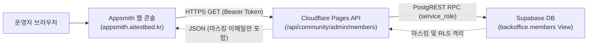

# ETF Campus 회원 운영 Appsmith 연동 아키텍처 및 운용 가이드

## 1. 아키텍처 개요
본 시스템은 데이터베이스 직접 포트 노출(PostgreSQL 5432)을 원천 배제하고, Cloudflare Pages 기반의 인증된 HTTPS REST API를 통해 운영 회원 데이터를 최소 권한으로 안전하게 중계합니다.

## 2. 보안 및 컴플라이언스 원칙
1. **Zero DB Credential in Appsmith**:
   - Appsmith에는 데이터베이스 직접 접속 암호(`appsmith_ro` 패스워드 등)가 일체 저장되지 않습니다.
   - 인증은 오직 Cloudflare Pages API용 `BACKOFFICE_READ_SECRET` Bearer 토큰을 Appsmith의 **서버 측 REST API Datasource 자격증명**에 저장하여 운용합니다.
   - 클라이언트 측 스토리지(`appsmith.store`)에 토큰을 저장하지 않으므로, 브라우저 개발자 도구나 애플리케이션 내보내기 JSON에 토큰이 노출되지 않습니다.
2. **원천 개인정보 보호 (Zero-Leakage & Masking)**:
   - `ops_private` 스키마 및 원본 이메일(`email`, `contact_email`)은 데이터베이스 RPC와 API 응답 단계에서 원천 배제됩니다.
   - 오직 `email_masked` (예: `k***@gmail.com`) 형태만 전송됩니다.
3. **토큰 무효화를 통한 API 접근 차단 (Revocation Gate)**:
   - 침해 의심 또는 접근 차단 필요 시, Cloudflare Pages 환경변수에서 `BACKOFFICE_READ_SECRET`을 제거하거나 회전하면 후속 API 조회가 즉시 HTTP 403 FORBIDDEN으로 차단됩니다. (실측 전 '1초 킬스위치' 등의 임의 시간 보장 표현은 배제).
4. **1차 릴리스 쓰기 제한 (Read-Only Enforcement)**:
   - 회원 상태 변경, 권한 변경, 웰컴 메일 발송 버튼은 화면 및 API 레벨에서 비활성화되어 있으며 오직 조회·검색·통계만 제공됩니다.

## 3. 호스트(`appsmith.aitestbed.kr`) 점검 실측 및 규정 검문
- **IP / 인프라**: `180.210.77.62` (NHN Cloud AS45974, 서울 리전).
- **포트 실측**: 80(HTTP), 443(HTTPS)만 인바운드 허용. 5432(DB) 및 관리 포트는 방화벽 차단.
- **접근 통제**: 비인가 접근 시 메인 서비스(`https://aitestbed.kr/`, "모두의 AI 실험실")로 302 리다이렉트.
- **운영자 사전 확인 필수 사항 (Integrity Veto)**:
  - 본 호스트는 "모두의 AI 실험실" 서비스와 인프라가 공유되어 있으므로, 운영 회원의 식별 데이터(마스킹 이메일 및 닉네임)를 본 호스트에서 처리할 수 있는 권한이 운영자에 의해 사전에 최종 승인되어야 합니다.
  - 호스트 OS 접근권한, Nginx access.log 요청 본문 기록 여부, 스냅샷 백업 주기 등은 운영자 검문 대상입니다.

## 4. Appsmith 서버 측 데이터소스 및 화면 연동 절차
> **주의**: `etf_campus_member_backoffice_appsmith.json` 파일은 선언적 앱 명세(Draft)이며, 실제 Appsmith 콘솔에 임포트하여 정상 통신을 확인하기 전까지는 "완성된 라이브 앱"으로 취급하지 않습니다.

1. **서버 측 데이터소스 생성 (Datasource Credential)**:
   - Appsmith 콘솔 (`https://appsmith.aitestbed.kr`) 접속.
   - **Datasources > New Datasource > REST API** 선택.
   - Datasource Name: `ETF_Campus_Backoffice_Datasource`
   - URL: `https://etf-campus.pages.dev/api/community/admin`
   - Headers (Appsmith 백엔드에 안전하게 보관됨):
     - `Authorization: Bearer <CONFIGURED_BACKOFFICE_READ_SECRET>`
     - `User-Agent: ETF-Campus-Appsmith-Client/1.0`
   - **Save** 클릭 (브라우저 `appsmith.store`나 클라이언트 변수에 토큰을 일체 노출하지 않음).
2. **애플리케이션 임포트**:
   - 작업 공간(`neo.alpharesearch's apps`)에서 **Create New > Import Application** 선택.
   - [`etf_campus_member_backoffice_appsmith.json`](./etf_campus_member_backoffice_appsmith.json) 파일 업로드.
   - 쿼리 `FetchMembersAndKPI`가 생성된 `ETF_Campus_Backoffice_Datasource`에 연결되어 있는지 확인.
3. **토큰 비노출 및 화면 검증**:
   - 브라우저 개발자 도구(Console / Application Storage)에서 `BACKOFFICE_READ_SECRET`이 존재하지 않는지 확인.
   - Appsmith에서 애플리케이션 내보내기(Export Application) 시 다운로드된 JSON에 평문 토큰이 포함되지 않는지 확인.
   - KPI 3종 통계(정상 시 수치, 실패 시 '조회 실패') 및 회원 테이블 페이징/검색 1회 실측.
