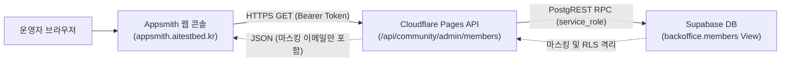

# ETF Campus 회원 운영 Appsmith 연동 아키텍처 및 운용 가이드

## 1. 아키텍처 개요
본 시스템은 데이터베이스 직접 포트 노출(PostgreSQL 5432)을 원천 배제하고, Cloudflare Pages 기반의 인증된 HTTPS REST API를 통해 운영 회원 데이터를 최소 권한으로 안전하게 중계합니다.

## 2. 보안 및 컴플라이언스 원칙
1. **Zero DB Credential in Appsmith**:
   - Appsmith에는 데이터베이스 접속 암호(`appsmith_ro` 패스워드 등)가 일체 저장되지 않습니다.
   - 오직 Cloudflare Pages 인증용 `BACKOFFICE_READ_SECRET` Bearer 토큰만 서버 측 자격증명으로 보관됩니다.
2. **원천 개인정보 보호 (Zero-Leakage & Masking)**:
   - `ops_private` 스키마 및 원본 이메일(`email`, `contact_email`)은 데이터베이스 RPC와 API 응답 단계에서 원천 배제됩니다.
   - 오직 `email_masked` (예: `k***@gmail.com`) 형태만 전송됩니다.
3. **긴급 차단 킬스위치 (Instant Revocation)**:
   - 침해 의심 또는 접근 차단 필요 시, Cloudflare Pages 대시보드 또는 CLI에서 `BACKOFFICE_READ_SECRET`을 제거하거나 회전하면 1초 이내에 모든 Appsmith 조회가 즉시 HTTP 403 FORBIDDEN으로 차단됩니다.
4. **1차 릴리스 쓰기 제한 (Read-Only Enforcement)**:
   - 회원 상태 변경, 권한 변경, 웰컴 메일 발송 버튼은 화면 및 API 레벨에서 비활성화되어 있으며 오직 조회·검색·통계만 제공됩니다.

## 3. 호스트(`appsmith.aitestbed.kr`) 점검 실측 및 규정 검문
- **IP / 인프라**: `180.210.77.62` (NHN Cloud AS45974, 서울 리전).
- **포트 실측**: 80(HTTP), 443(HTTPS)만 인바운드 허용. 5432(DB) 및 관리 포트는 방화벽 차단.
- **접근 통제**: 비인가 접근 시 메인 서비스(`https://aitestbed.kr/`, "모두의 AI 실험실")로 302 리다이렉트.
- **운영자 사전 확인 필수 사항 (Integrity Veto)**:
  - 본 호스트는 "모두의 AI 실험실" 서비스와 인프라가 공유되어 있으므로, 운영 회원의 식별 데이터(마스킹 이메일 및 닉네임)를 본 호스트에서 처리할 수 있는 법적/보안적 권한이 사전에 확인되어야 합니다.
  - 서버 호스트의 OS 관리자 권한, 백업 스냅샷 주기, Nginx/컨테이너 로그 보존 정책(요청/응답 본문 기록 여부)은 운영자의 최종 승인 검문 대상입니다.

## 4. Appsmith 앱 임포트 및 설정 방법
1. Appsmith 콘솔 로그인 (`https://appsmith.aitestbed.kr`).
2. 작업 공간(`neo.alpharesearch's apps` 등)에서 **Create New > Import Application** 선택.
3. [`etf_campus_member_backoffice_appsmith.json`](./etf_campus_member_backoffice_appsmith.json) 파일 업로드.
4. **Appsmith Settings > App Settings > Appsmith Store** 또는 API Query 헤더에서:
   - `Authorization: Bearer <CONFIGURED_BACKOFFICE_READ_SECRET>` 설정.
5. 화면 로드 시 KPI 3종 및 회원 테이블이 정상 표시되는지 확인.
